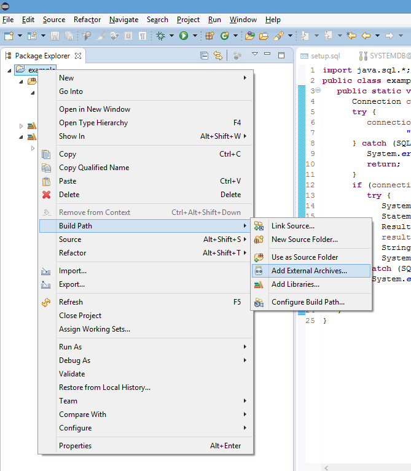
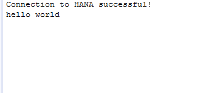

## Prerequisites  
 - **Proficiency:** Beginner
 - **Setup:** This tutorial assumes that you have followed the [SAP HANA Client Installation and Update Guide](https://help.sap.com/hana/SAP_HANA_Client_Installation_Update_Guide_en.pdf) to install the HANA client software. You can download the HANA client software from [SAP Store](https://store.sap.com/sap/cpa/ui/resources/store/html/SolutionDetails.html?pid=0000012950)

## Next Steps
 - [View similar How-Tos](http://www.sap.com/developer/tutorials.html) or [View all How-Tos](http://www.sap.com/developer/tutorials.html)


## How-To Details
Java Database Connectivity (JDBC) is a Java-based application programming interface (API) which includes a set of functions that enable Java applications to access a data model in a database. The SAP HANA client includes a dedicated JDBC interface.

In this how-to, you will learn how to connect to HANA Express Edition using JDBC (Java Database Connectivity)

### Time to Complete
**10 Min**.

---

1. You have to install the JDBC driver. The driver (`ngdbc.jar`) is installed as part of the SAP HANA client installation and is located at:

    `C:\Program Files\SAP\hdbclient\` on Microsoft Windows platforms

    `/usr/sap/hdbclient/` on Linux and UNIX platforms

2. Add ```ngdbc.jar``` to your class path. If you are using Eclipse / HANA Studio, you would right-click on the project you are currently working on, and select **Build Path -> Add External Archives** and then add the ```ngdbc.jar``` by browsing for it.

    

3. Create a new file called ```jdemo.java```, and write Java code to create a connection to the database and execute SQL commands. Use a connection string in the form of ```jdbc:sap://<server>:<port>[/?<options>]```. For example: ```jdbc:sap://myServer:30015/?autocommit=false```. The port should be ```3<instance number>15```, for example, ```30015```, if the instance is ```00```.

    You can specify one or more failover servers by adding additional hosts, as in the following example:  ```jdbc:sap://myServer:30015;failover1:30015;failover2:30015/?autocommit=false```.

    To connect to a specific database in a multiple-database environment, for example, ```tdb1```, use the ```databaseName``` parameter, as illustrated in the following code: ```jdbc:sap://localhost:30015/?databaseName=tdb1&user=SYSTEM&password=manager```.

    The following is an example of connecting to an SAP HANA server called ```myhdb``` and database name ```HXE```, which was installed as instance ```07```, with user name ```myname``` and password ```mysecret```.

    ```java
    import java.sql.*;
    public class jdemo {
     public static void main(String[] argv) {
        Connection connection = null;
        try {                  
           connection = DriverManager.getConnection(
              "jdbc:sap://myhdb:30715/?databaseName=HXE", "myname", "mysecret");                  
        } catch (SQLException e) {
           System.err.println("Connection Failed. User/Passwd Error?");
           return;
        }
        if (connection != null) {
           try {
              System.out.println("Connection to HANA successful!");
              Statement stmt = connection.createStatement();
              ResultSet resultSet = stmt.executeQuery("Select 'hello world' from dummy");
              resultSet.next();
              String hello = resultSet.getString(1);
              System.out.println(hello);
         } catch (SQLException e) {
            System.err.println("Query failed!");
         }
       }
       }
    }
    ```

5. Compile the file `jdemo.java` and execute the code. You should see an output similar to the following:

    


    Congratulations: You have just connected to HANA using JDBC (Java Database Connectivity) !

## Related Information

1. [SAP HANA Database - Client Installation and Update Guide](https://help.sap.com/hana/SAP_HANA_Client_Installation_Update_Guide_en.pdf)

## Next Steps
 - [View similar How-Tos](http://www.sap.com/developer/tutorials.html) or [View all How-Tos](http://www.sap.com/developer/tutorials.html)
