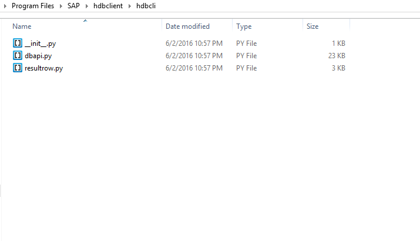

## Prerequisites  
 - **Setup:** This tutorial assumes that you have followed the [How to Install SAP HANA 2.0, express edition Clients](http://www.sap.com/developer/how-tos/2016/12/hxe-ua-howto-installing-clients.html) tutorial to install the HANA, express edition client software.

## Next Steps
 - This is a standalone How-To on establishing basic connectivity to SAP HANA database server in python. [View similar How-Tos](http://www.sap.com/developer/tutorials.html) or [View all How-Tos](http://www.sap.com/developer/tutorials.html)


 __ NOTE: SAP HANA, express edition version 2.0 implications on 'How-Tos' and 'Tutorials' __

 The available HANA, express edition versions (1.0 SP12 and 2.0 SP00) have different default instance numbers. The published Tutorials and How-Tos refer to the default HANA 2.0 SP00 instance numbers. When using the SP12 version please use the old default instance number and port (3`<instance number>`15):

 HANA Express Version  | Default Instance ID | Port
 :-------------------  | :------------------ | :---------------
 1.0 SP12              |  00                 | 30015
 2.0 SP00              |  90                 | 39015

## How-To Details
In many python applications, you would need access to a database for storing, retrieving and other uses of data. In this How-To, you will use a sample database connection program using SAP HANA Client that provides python connectivity to SAP HANA libraries and executables.

### Time to Complete
**10 Min**.

---

1. Navigate to the path where **HANA client** is installed and then copy these three files `__init__.py, dbapi.py, resultrow.py`. By default, the SAP Client is installed at:

    Microsoft Windows :- `C:\Program Files\SAP\hdbclient\`

    Linux Platform :- `/usr/sap/hdbclient/`

    

2. Then go to the `Python` directory under `hdbclient` directory and paste all three files into the `Lib` directory.

    

3. Copy `pyhdbcli.pdb`, `pyhdbcli.pyd` files from `hdbclient` directory.

    

4. Do the same as step 2 above, paste the files into `Python/Lib` directory. Now you are done with the configuration part.

5. In this step, copy and paste the below code in an editor and save the file with the `.py` extension. In the below example, The port `3< instance number >15` matches to the tenant database named `HXE`.

    ```python
    import dbapi

    #Replace with your hostname, unique port for the database you are connecting,
    #UserID and password in that order.
    connection=dbapi.connect('hxehost', 39013, 'system', 'MyPassword')

    #This statement prints true if the connection is successfully established
    print connection.isconnected()
    ```

6. Copy the file into `Python` directory of **HANA Client**  and execute in the same directory using command
    >`python filename.py`.

    Or if you are using python IDE, assign `python.exe` from the same directory as the python executable.

7. Run the program and if the program prints *True*, then the connection to SAP HANA database is successful.

## Next Steps
 - [View similar How-Tos](http://www.sap.com/developer/tutorials.html) or [View all How-Tos](http://www.sap.com/developer/tutorials.html)
