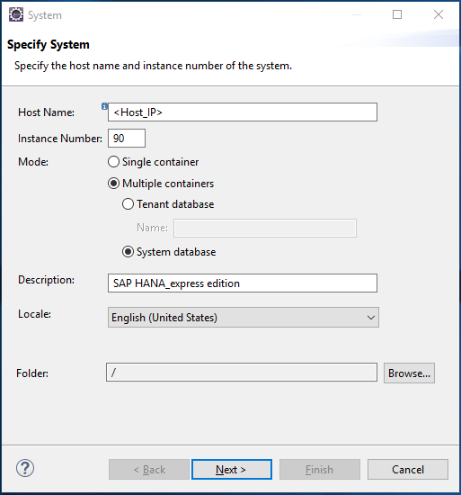

## Prerequisites  
- Proficiency: beginner
- Setup: Eclipse Mars or Neon version are expected to be installed and running before starting this tutorial to add the HANA Plugin.

## Next Steps
- [Go to tutorials](http://www.sap.com/developer/tutorials.html)

## How-To Details
Provides instruction on how to install and update the SAP HANA Tools plugin for Eclipse and connect `HANAExpress`.

### Time to Complete
**10 Min**.

---

[ACCORDION-BEGIN [Step 1: ](Install development tools)]

In Eclipse, choose in the menu bar Help > Install New Software...

Select SAP Development Tools for Eclipse

- Neon (4.6), add the URL https://tools.hana.ondemand.com/neon/
- Mars (4.5), add the URL https://tools.hana.ondemand.com/mars/

[ACCORDION-END]

[ACCORDION-BEGIN [Step 2: ](Select features)]

Press Enter to display the available features.

Select the desired features and choose Next.

[ACCORDION-END]

[ACCORDION-BEGIN [Step 3: ](Review wizard page)]

On the next wizard page, you get an overview of the features to be installed. Choose Next.

[ACCORDION-END]

[ACCORDION-BEGIN [Step 4: ](Accept license agreements)]

Confirm the license agreements and select Finish to start the installation. (Depending on the features chosen the installation may take up to 10 minutes.)

[ACCORDION-END]

[ACCORDION-BEGIN [Step 5: ](Restart Eclipse)]

Restart Eclipse as prescribed after adding HANA Plugin.

[ACCORDION-END]

[ACCORDION-BEGIN [Step 6: ](Open SAP HANA Administrative Console)]

Change perspective to SAP HANA Administrative Console Window > Perspective > SAP HANA Administrative Console

[ACCORDION-END]

[ACCORDION-BEGIN [Step 7: ](Specify system)]

Add your `HANAExpress` Add System > Specify System

Configuration:

- Hostname: `HANAExpress` Hostname (use `/sbin/ifconfig` to find IP address of host)
- Instance number: 90 (or 00 for SAP HANA 1.0, express edition installations)
- Mode: _Multiple containers_ > _System database_
- Description: `HANAExpress` Edition

[ACCORDION-END]

[ACCORDION-BEGIN [Step 8: ](Specify connection properties)]

Connection Properties:

- Authentication by database user:
- User Name: SYSTEM
- Password: `password`

>(Note - you might be asked to change the SYSTEM user password if this is the first login)

- Enable SAP start service Connection
- Finish

[ACCORDION-END]

[ACCORDION-BEGIN [Step 9: ](Confirm connection)]

Confirm connection as shown below:

[ACCORDION-END]

## Next Steps
- [View similar How-Tos](http://www.sap.com/developer/tutorials.html) or [View all How-Tos](http://www.sap.com/developer/tutorials.html)
