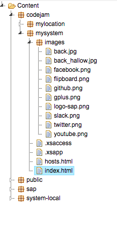
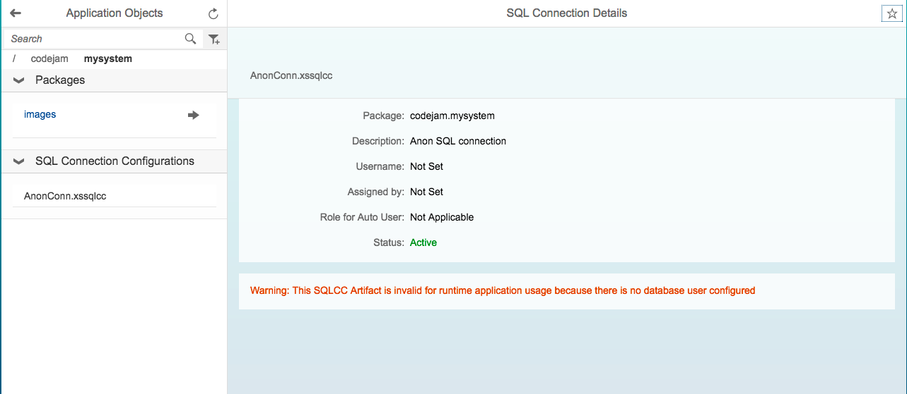
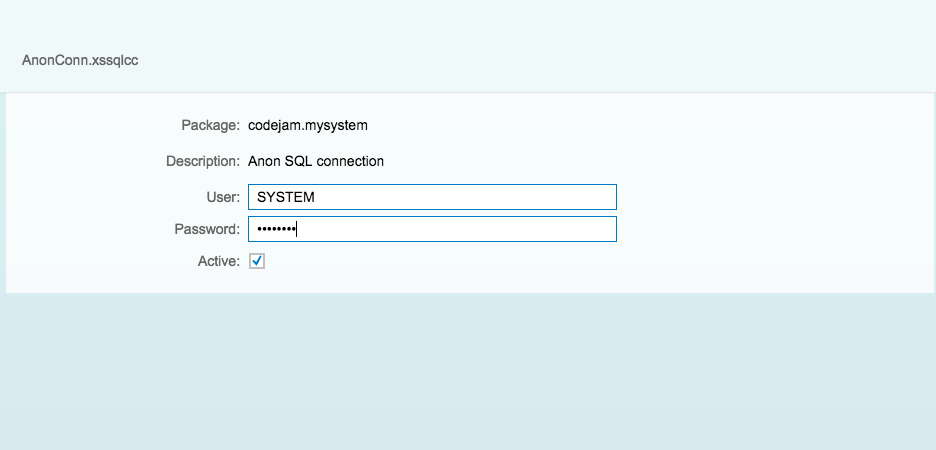
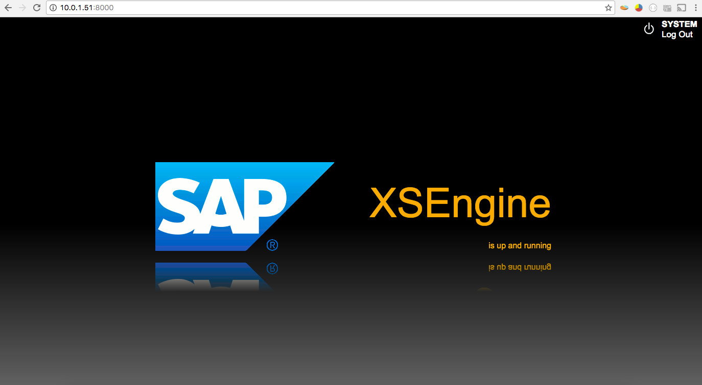
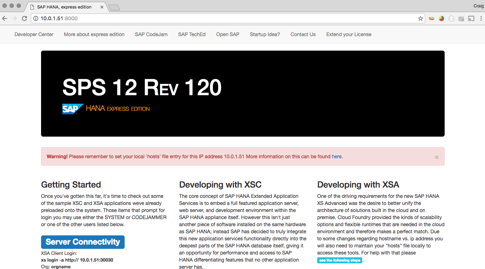

## Prerequisites  
 - **Systems used:** SAP HANA express edition
 - [Adding a Custom Login Screen to your HXE system](http://www.sap.com/developer/how-tos/2016/10/hxe-custom-login.html)

## Next Steps
 - [View all How-Tos](http://www.sap.com/developer/tutorial-navigator.how-to.html)


## How-To Details
The purpose behind this guide is to show you how to add a custom landing page to your system, thus changing the default one and allowing for even more customization to your system.

### Time to Complete
**10 Min**.

---

1. In the previous guide you created a new application and a new custom login screen now you will enhance the existing `index.html` file and add a new file called `hosts.html` as well as a few additional images. Therefore go back into your `Editor` and open the `index.html` file and change the contents to match the following.

	```
	<!DOCTYPE html>
		<html lang="en">
		<head>
		    <title>SAP HANA, express edition</title>
		    <meta charset="utf-8">
		    <meta name="viewport" content="width=device-width, initial-scale=1">
		    <link rel="stylesheet" href="http://maxcdn.bootstrapcdn.com/bootstrap/3.3.6/css/bootstrap.min.css">
		    <script src="https://ajax.googleapis.com/ajax/libs/jquery/1.12.0/jquery.min.js"></script>
		    <script src="http://maxcdn.bootstrapcdn.com/bootstrap/3.3.6/js/bootstrap.min.js"></script>
		    <style>
		        h1.vTitle {
		            color: #ffffff;
		            font-variant: small-caps;
		        }
		        p.eTitle {
		            color: #F0AB00;
		            font-variant: small-caps;
		        }
		    </style>
		    <script type="text/javascript">
		        $(document).ready(function() {
		            $("#hostfile").hide();
		            if ( location.hostname === 'hxehost' ) {
		                $('#hostfile').hide();
		            }else{
		                $("#hostfile").show();
		            }
		        });
		    </script>
		</head>
		<body>

		<div id="custom-bootstrap-menu" class="navbar navbar-default " role="navigation">
		    <div class="container-fluid">
		        <div class="collapse navbar-collapse navbar-menubuilder">
		            <ul class="nav navbar-nav navbar-left">
		                <li><a href="http://developers.sap.com">Developer Center</a>
		                </li>
		                <li><a href="http://www.sap.com/developer/topics/sap-hana-express.html">More about express edition</a>
		                </li>
		                <li><a href="http://www.sap.com/developer/events.html">SAP CodeJam</a>
		                </li>
		                <li><a href="http://sapteched.com">SAP TechEd</a>
		                </li>
		                <li><a href="https://open.sap.com/course/hana1-1">Open SAP</a>
		                </li>
		                <li><a href="http://startupfocus.saphana.com/">Startup Idea?</a>
		                </li>
		                <li><a href="mailto:developers@sap.com">Contact Us</a>
		                </li>
		                <li><a href="http://service.sap.com/sap/bc/bsp/spn/minisap/minisap.htm">Extend your License</a>
		                </li>
		            </ul>
		        </div>
		    </div>
		</div>

		<div class="container">
		  <div class="jumbotron" style="background-color: black">
		    <h1 class="vTitle">SPS 12 Rev 120</h1>
		    <p class="eTitle"> HANA express edition</p>
		  </div>

		    <div class="alert alert-danger" id="hostfile">
		        <a href="#" class="close" data-dismiss="alert" aria-label="close">&times;</a>
		        <strong>Warning!</strong> Please remember to set your local 'hosts' file entry for
		        this IP address <script>document.write(location.hostname)</script> More information on this can be found <a href="hosts.html">here</a>.
		    </div>

		  <div class="row">
		    <div class="col-sm-4">
		        <h3>Getting Started</h3>
		        <p>
		        Once you've gotten this far, it's time to check out some of the sample XSC and XSA
		        applications weve already preloaded onto the system. Those items that prompt for
		        login you may use either the SYSTEM or CODEJAMMER or one of the other	users listed below.
		        </p>
		        <h2><span class="label label-primary">Server Connectivity</span></h2>
		        <p style="font-size:small">
		            XSA Client Login:
		            <br><strong>xs login -a http:// <script> document.write(location.hostname);</script>:30030</strong>
		            <br>Org: <strong>orgname</strong>
		            <br>Space: <strong>DEV</strong>
		        </p>
		        <h2><span class="label label-primary">Users</span></h2>
		        <p style="font-size:small">System <a rel="external" href="/sap/hana/ide/security/">User</a> Administration</p>
		        <p style="font-size:small;">
		            Role: System
		            <br>User: <strong>SYSTEM</strong>
		            <br>Password: <strong>&lt;given during system creation&gt;</strong>
		        </p>
		        <br>

		        <div class="panel panel-info">
		            <div class="panel-heading">Get Social</div>
		            <div class="panel-body">
		                <p>
		                <a href="http://joinsapcodejam.herokuapp.com/"></a>
		                &nbsp;&nbsp;&nbsp;<a href="https://flipboard.com/section/sap-devs---codejam-baqSwF"></a>
		                &nbsp;&nbsp;&nbsp;<a href="https://www.facebook.com/sapdevelopers"></a>
		                &nbsp;&nbsp;&nbsp;<a href="https://twitter.com/sapdevs"></a>
		                &nbsp;&nbsp;&nbsp;<a href="https://www.youtube.com/user/sapdevs"></a>
		                &nbsp;&nbsp;&nbsp;<a href="https://plus.google.com/b/110467182944070838581/"></a>
		                &nbsp;&nbsp;&nbsp;<a href="https://github.com/sap"></a>
		                </p>
		            </div>
		        </div>  


		        <div class="panel panel-info">
		            <div class="panel-heading">Installing a Delivery Unit (DU)</div>
		            <div class="panel-body">
		                <p>
		                Additional applications, content and material can easily be added to your
		                system with the use of a DU. Follow the instructions below for both import
		                as well as exporting these items.
		                </p>
		                If you would like to save your work, create a new DU and assign your repository content to it. If you would like to add
		                additional material simply choose import, note that due to dependcies you may need to import more than once for
		                everything to activate fully. Follow this <a rel="external" href="/sap/hana/xs/lm/?page=DUManagementTab"><span class="label label-info">link</span></a> to create or import DU's
		            </div>
		        </div>  

		        <div class="panel panel-info">
		            <div class="panel-heading">Self Signed Certificate for HTTPS</div>
		            <div class="panel-body">
		                <p>
		                Wish to work with HTTPS instead of HTTP? You just need to setup and download the self signed certificate. Follow this <a href="/sap/hana/xs/admin/#/trustManager/SAPLOGON"><span class="label label-info">link</span></a> to modify and export the certificate.
		                </p>
		            </div>
		        </div>  

		    </div>

		    <div class="col-sm-4">
		        <h3>Developing with XSC</h3>
		        <p>
		        The core concept of SAP HANA Extended Application Services is to embed a full featured
		        application server, web server, and development environment within the SAP HANA appliance itself.
		        However this isn't just another piece of software installed on the same hardware as SAP HANA;
		        instead SAP has decided to truly integrate this new application services functionality directly
		        into the deepest parts of the SAP HANA database itself, giving it an opportunity for performance
		        and access to SAP HANA differentiating features that no other application server has.  
		        </p>

		    	<ul class="list-group">
		    	    <li class="list-group-item list-group-item-info">Tools</li>
		            <li class="list-group-item list-group-item"><a rel="external" href="/sap/hana/xs/debugger/index.html">XSC Debugging</a></li>
		            <li class="list-group-item list-group-item"><a rel="external" href="/sap/hana/xs/lm/?page=HomeTab">XSC Lifecycle Management</a></li>
		    		<li class="list-group-item list-group-item"><a rel="external" href="/sap/hana/ide/editor/">XSC Web-based Development Workbench</a></li>
		            <li class="list-group-item list-group-item"><a rel="external" href="/sap/hana/xs/admin/">XSC Admin</a></li>
		    	</ul>

		    	<ul class="list-group">
		    	    <li class="list-group-item list-group-item-success"><a href="http://www.sap.com/developer/tutorials.html?" target="_self">Full Tutorial Catalog</a></li>
		    	</ul>

		    </div>
		    <div class="col-sm-4">
		        <h3>Developing with XSA</h3>        
		        <p>
		          One of the driving requirements for the new SAP HANA XS Advanced was the desire to better unify
		          the architecture of solutions built in the cloud and on premise. Cloud Foundry provided the
		          kinds of scalability options and flexible runtimes that are needed in the cloud environment and
		          therefore makes a perfect match. Due to some changes regarding hostname vs. ip address you will
		          also need to maintain your "hosts" file locally to access these tools. For help with that please
		          <a href="hosts.html"><strong><span class="label label-info">see the following steps</span></strong></a>.
		        </p>

		        <br />
		    	<ul class="list-group">
		    	    <li class="list-group-item list-group-item-info">Tools</li>
		            <li class="list-group-item list-group-item"><a rel="external" href="#" id="XSAJobId">SAP Web IDE for SAP HANA</a></li>
		            <script>
		                document.getElementById('XSAJobId').href = 'http://'+location.hostname+':53075/'
		            </script>
		    	</ul>

		        <br />
		        <br />
		        <br />
		        <br />
		        <br />
		        <br />

		    </div>
		  </div>
		</div>

		<br />
		<br />
		<br />
		<footer class="footer">
		  <div class="container">
		    <a href="http://sap.com">SAP.com</a>&nbsp;&nbsp;
			<a href="http://www.sap.com/about/legal/privacy.html" title="SAP.com" target="_self">Privacy</a>&nbsp;&nbsp;
			<a href="http://global.sap.com/corporate-en/legal/terms-of-use.epx" title="SAP.com" target="_self">Terms of Use</a>&nbsp;&nbsp;
			<a href="https://tools.hana.ondemand.com/developer-license-3.0.0.txt" title="Developer License" target="_self">Developer License</a>&nbsp;&nbsp;
			<a href="http://global.sap.com/corporate-en/legal/impressum.epx" title="SAP.com" target="_self">Legal Disclosure</a>&nbsp;&nbsp;
			<a href="http://global.sap.com/corporate-en/legal/copyright/index.epx" title="SAP.com" target="_self">Copyright</a>&nbsp;&nbsp;
			Request an SAP CodeJam? <a href="mailto:sapcodejam@sap.com">sapcodejam@sap.com</a>&nbsp;&nbsp;
		  </div>
		</footer>

		</body>
	</html>
	```

2. Now add a new file called `hosts.html` and change the contents to match the following.

	```
	<!DOCTYPE html>
		<html lang="en">
		<head>
		    <title>SAP HANA, express edition</title>
		    <meta charset="utf-8">
		    <meta name="viewport" content="width=device-width, initial-scale=1">
		    <link rel="stylesheet" href="http://maxcdn.bootstrapcdn.com/bootstrap/3.3.6/css/bootstrap.min.css">
		    <script src="https://ajax.googleapis.com/ajax/libs/jquery/1.12.0/jquery.min.js"></script>
		    <script src="http://maxcdn.bootstrapcdn.com/bootstrap/3.3.6/js/bootstrap.min.js"></script>
		    <style>
		        h1.vTitle {
		            color: #ffffff;
		            font-variant: small-caps;
		        }
		        p.eTitle {
		            color: #F0AB00;
		            font-variant: small-caps;
		        }
		    </style>
		    <script type="text/javascript">
		        $(document).ready(function() {
		            $("#hostfile").hide();
		            if ( location.hostname === 'hxehost' ) {
		                $('#hostfile').hide();
		                $('#finished').show();
		            }else{
		                $("#hostfile").show();
		                $('#finished').hide();
		            }
		        });
		    </script>
		</head>
		<body>

		<div id="custom-bootstrap-menu" class="navbar navbar-default " role="navigation">
		    <div class="container-fluid">
		        <div class="collapse navbar-collapse navbar-menubuilder">
		            <ul class="nav navbar-nav navbar-left">
		                <li><a href="http://developers.sap.com">Developer Center</a>
		                </li>
		                <li><a href="http://www.sap.com/developer/topics/sap-hana-express.html">More about express edition</a>
		                </li>
		                <li><a href="http://www.sap.com/developer/events.html">SAP CodeJam</a>
		                </li>
		                <li><a href="http://sapteched.com">SAP TechEd</a>
		                </li>
		                <li><a href="https://open.sap.com/course/hana1-1">Open SAP</a>
		                </li>
		                <li><a href="http://startupfocus.saphana.com/">Startup Idea?</a>
		                </li>
		                <li><a href="mailto:developers@sap.com">Contact Us</a>
		                </li>
		                <li><a href="http://service.sap.com/sap/bc/bsp/spn/minisap/minisap.htm">Extend your License</a>
		                </li>
		            </ul>
		        </div>
		    </div>
		</div>

		<div class="container">
		  <div class="jumbotron" style="background-color: black">
		    <h1 class="vTitle">SPS 12 Rev 120</h1>
		    <p class="eTitle"> HANA, express edition</p>
		  </div>

		    <div class="alert alert-warning" id="hostfile">
		        <a href="#" class="close" data-dismiss="alert" aria-label="close">&times;</a>
		        <strong>Warning!</strong> Please remember to set your local 'hosts' file entry for
		        this IP address <script>document.write(location.hostname)</script> More information on this can be found <a href="hosts.html">here</a>.
		    </div>

		    <div class="alert alert-info" id="main">
		        <a href="#" class="close" data-dismiss="alert" aria-label="close">&times;</a>
		        With XSA several links require the actual hostname of the server as opposed to the IP
		        address and therefore it is necessary to modify your local "hosts" file to reflect that.
		        You will need to modify a file on your system and quite possibly you will need to do this
		        as Administrator or with user that has Administrator rights.
		    </div>

		    <div class="alert alert-success" id="finished">
		        <a href="#" class="close" data-dismiss="alert" aria-label="close">&times;</a>
		        You seem to have successfully changed your 'host' file and are accessing the system with the hostname and not the IP address.
		    </div>

		  <div class="row">
		    <div class="col-sm-4">    
		        <h2>Windows</h2>
		        <ol style="margin: 0 60px 10px 36px; font-size: 14px; line-height: 17px; list-style: inherit;">
		            <li>In Notepad, open the following file: c:\Windows\System32\Drivers\etc\hosts</li>
		            <li>Add the following line or modify it if you already have it.
		            <p><br />
		                <script>
		                document.write(location.hostname + "&nbsp;&nbsp;&nbsp;&nbsp;&nbsp;&nbsp;&nbsp;&nbsp;&nbsp;&nbsp;vhcalhdbdb");
		                </script>
		            </li>
		            <li>Click File > Save to save your changes.</li>
		        </ol>
		    </div>

		    <div class="col-sm-4">    
		        <h2>Linux</h2>
		        <ol style="margin: 0 60px 10px 36px; font-size: 14px; line-height: 17px; list-style: inherit;">
		            <li>Open your Terminal or Shell application and type the command <strong>sudo nano /etc/hosts</strong></li>
		            <li>Add the following line or modify it if you already have it.
		            <p><br />
		                <script>
		                document.write(location.hostname + "&nbsp;&nbsp;&nbsp;&nbsp;&nbsp;&nbsp;&nbsp;&nbsp;&nbsp;&nbsp;hxehost");
		                </script>
		            </li>
		            <li>Control-x</li>
		            <li>select y to save</li>
		        </ol>
		    </div>

		    <div class="col-sm-4">    
		        <h2>MAC OS X (10.6 to 10.8)</h2>
		        <ol style="margin: 0 60px 10px 36px; font-size: 14px; line-height: 17px; list-style: inherit;">
		            <li>Open <strong>/Applications/Utilities/Terminal</strong></li>
		            <li>type the following command <strong>sudo nano /private/etc/hosts</strong></li>
		            <li>Add the following line or modify it if you already have it, this should be after the default mappings present.
		            <p><br />
		                <script>
		                document.write(location.hostname + "&nbsp;&nbsp;&nbsp;&nbsp;&nbsp;&nbsp;&nbsp;&nbsp;&nbsp;&nbsp;vhcalhdbdb");
		                </script>
		            </li>
		            <li>Control-x</li>
		            <li>select y to save</li>
		            <li>To ensure the changes take effect try one of the following commands
		                <br />
		                <p></p>
		                <p>
		                    OS X Lion/Mountain Lion <strong>sudo killall -HUP mDNSResponder</strong>
		                </p>                                                     
		                <p>
		                    OS X Mavericks <strong>dscacheutil -flushcache; sudo killall -HUP mDNSResponder</strong>
		                </p>
		            </li>
		        </ol>
		    </div>
		  </div>

		    <p></p>
		    <a href="index.html">&nbsp;&nbsp;Back to Sample Applications</a>

		    </div>
		  </div>
		</div>

		<br />
		<br />
		<br />
		<footer class="footer">
		  <div class="container">
		    <a href="http://sap.com">SAP.com</a>&nbsp;&nbsp;
			<a href="http://www.sap.com/about/legal/privacy.html" title="SAP.com" target="_self">Privacy</a>&nbsp;&nbsp;
			<a href="http://global.sap.com/corporate-en/legal/terms-of-use.epx" title="SAP.com" target="_self">Terms of Use</a>&nbsp;&nbsp;
			<a href="https://tools.hana.ondemand.com/developer-license-3.0.0.txt" title="Developer License" target="_self">Developer License</a>&nbsp;&nbsp;
			<a href="http://global.sap.com/corporate-en/legal/impressum.epx" title="SAP.com" target="_self">Legal Disclosure</a>&nbsp;&nbsp;
			<a href="http://global.sap.com/corporate-en/legal/copyright/index.epx" title="SAP.com" target="_self">Copyright</a>&nbsp;&nbsp;
			Request an SAP CodeJam? <a href="mailto:sapcodejam@sap.com">sapcodejam@sap.com</a>&nbsp;&nbsp;
		  </div>
		</footer>

		</body>
	</html>
	```

3. Next click on the package `images` and upload the multiple images, here you can use those attached to this guide or find your own.

	

4. Now with your savings down, your page content changed you can open each and see if it meets your needs. You can put anything you like into these pages of course.

	

5. In order to finalize the configuration change to the server you will need to implement a few more items. Now add a new file called `AnonConn.xssqlcc` with the following contents.

	```
	{
  		"description" : "Anon SQL connection"
	}
	```

6. Open the `.xsaccess` file and modify the following line.

	```
	"anonymous_connection" : "codejam.mysystem::AnonConn",
	```

7. Now you will need to go back to the XS admin tool, `http://server:8000/sap/hana/xs/admin/#/package/codejam.mysystem/sqlcc/AnonConn` and you will need to edit the service and enter your `SYSYTEM` user.

	

	

8. Once you click save the service should be enabled for runtime usage.

	

9. The final step necessary to turn these changes into your landing page is to make a change to your system configuration. Run the following statement from our `Catalog` editor. HXE is typically a multi-tenancy system so you will need to make the changes to the `nameserver.ini` and if it is a single database system the changes would go to the `xsengine.ini` file.

	```
	ALTER SYSTEM ALTER CONFIGURATION ('nameserver.ini', 'SYSTEM') SET ('httpserver','root_page') = '/codejam/mysystem/index.html' WITH RECONFIGURE;
	```

10. Once that statement has executed your server should change from the default to your new custom page.

	

11. Now if you return to the default URL of the server you should see your new landing page.

	


## Next Steps
 - [View all How-Tos](http://www.sap.com/developer/tutorial-navigator.how-to.html)
