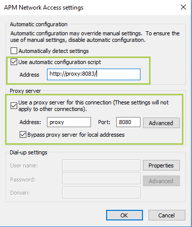
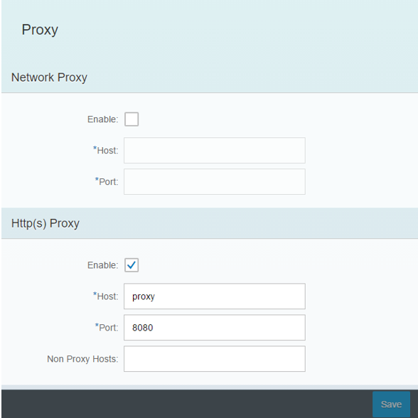

## Prerequisites
- You have installed SAP HANA 2.0, express edition using either the [Installing Binary](http://www.sap.com/developer/tutorials/hxe-ua-installing-binary.html) or [Installing the VM Image](http://www.sap.com/developer/tutorials/hxe-ua-installing-vm-image.html) tutorial.

## Next Steps
- [View similar How-Tos](http://www.sap.com/developer/tutorials.html) or [View all How-Tos](http://www.sap.com/developer/tutorials.html)

## How-To Details

Telemetry is enabled by default in SAP HANA 2.0, express edition. Use this tutorial to learn more about the telemetry feature, check your proxy settings, and disable telemetry if desired.


### Time to Complete
**5 Min**.

---

[ACCORDION-BEGIN [Step 1: ](What is Telemetry?)]

When you install SAP HANA 2.0, express edition, Telemetry is enabled by default. You can disable telemetry after installation is complete. Telemetry sends anonymous performance statistics and usage statistics to SAP, so that SAP can focus development efforts on areas most vital to the SAP HANA 2.0, express edition customer base.

>**Important**: Your privacy is critical to SAP. Telemetry collects anonymous usage information while ensuring complete privacy. No identifying information or private information is collected, and you can opt out of telemetry at any time.

[DONE]
[ACCORDION-END]

[ACCORDION-BEGIN [Step 2: ](Disable Telemetry Using hxe_telemetry.sh)]

Disable Telemetry if you wish to stop sending anonymous telemetry data to SAP.

Start SAP HANA 2.0, express edition and log in as `hxeadm`.

Run:
```
/usr/sap/<sid>/home/bin/hxe_telemetry.sh -i 90 -u SYSTEM -p "<your_password>" -d SystemDB --disable
```
>**Tip**: If you installed using the Virtual Machine method, `<sid>` is `HXE`.

[DONE]
[ACCORDION-END]

[ACCORDION-BEGIN [Step 3: ](Renable Telemetry)]

To re-enable telemetry, run:
```
/usr/sap/<sid>/home/bin/hxe_telemetry.sh -i 90 -u SYSTEM -p "<your_password>" -d SystemDB --enable
```
>**Tip**: If you installed using the Virtual Machine method, `<sid>` is `HXE`.

[DONE]
[ACCORDION-END]

[ACCORDION-BEGIN [Step 4: ](Check Your Proxy Settings)]

If you are inside a corporate firewall and use a proxy for connecting to http and https servers, you need to identify your proxy settings, log in to Cockpit, and update the  **Cockpit Settings > Proxy** page.

>**Note**: If your Cockpit proxy settings are incorrect, telemetry will not work properly.

1. Obtain your proxy settings from your network administrator.

    >**Note**: If you are not inside a firewall, you can ignore this step and skip to the next topic.

    - You set your proxy settings earlier in this tutorial. In this example using Internet Explorer on Windows 10, notice how connections use a proxy server on port 8080.

        

2. In Cockpit, select **Cockpit Settings > Proxy**.

    

    - Under **Http(s) Proxy**, verify that **Enable** is checked.

        >**Note**: **Http(s) Proxy** should be enabled, not the **Network Proxy**.

    - In **Host**, **Port**, and **Non Proxy Hosts**, verify the settings provided by your IT administrator.

        Make sure the host has a fully qualified domain name.

    - If you made any changes, click  **Save**.

[DONE]
[ACCORDION-END]

[ACCORDION-BEGIN [Step 5: ](Get Telemetry Help)]

If you want to learn more about the `hxe_telemetry.sh` script, type **`./hxe_telemetry.sh --help`**

[DONE]
[ACCORDION-END]

## Next Steps
- [View similar How-Tos](http://www.sap.com/developer/tutorials.html) or [View all How-Tos](http://www.sap.com/developer/tutorials.html)
