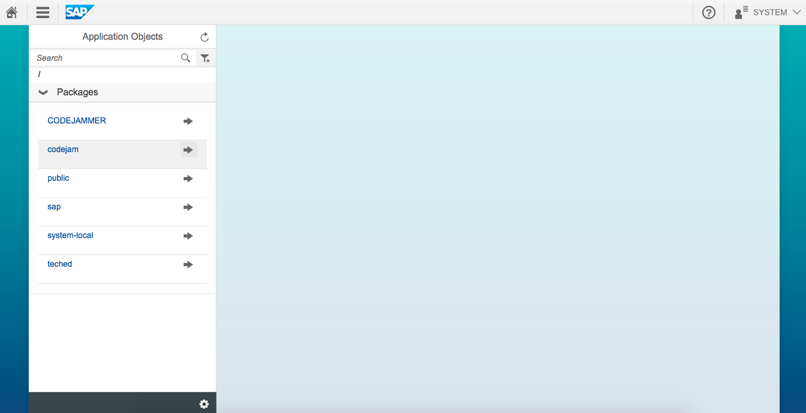
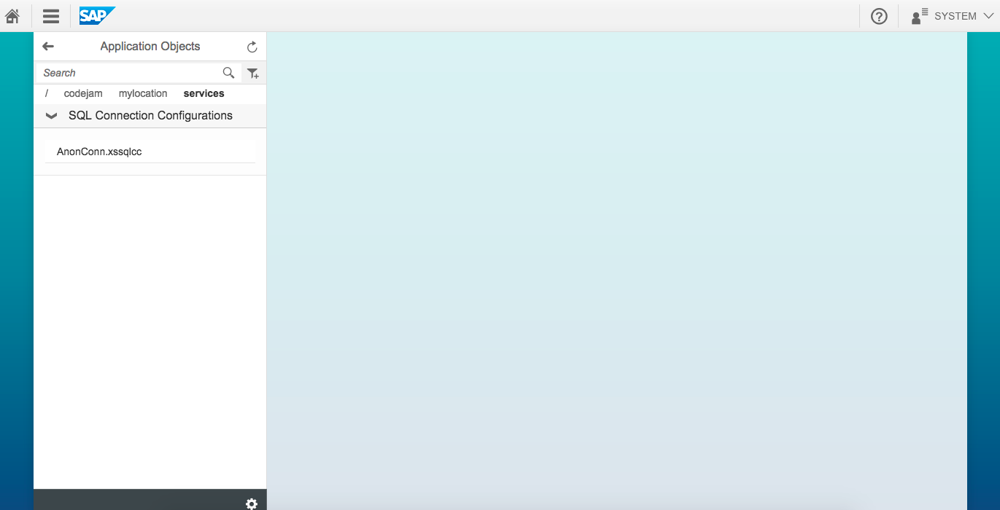
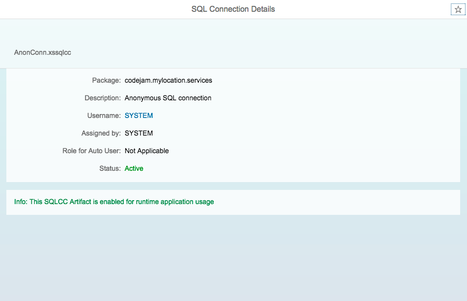

## Prerequisites  
 - **Systems used:** SAP HAHA, SAP HANA express edition, SAP Cloud Platform MDC instance

## Next Steps
 - [View all How-Tos](http://www.sap.com/developer/tutorial-navigator.how-to.html)


## How-To Details
The following how to guide will show you how to enable an anonymous connection to your XSC application. In many cases you will of course not want anonymous access however there may be a case where it would be prudent or even required.

The simple steps should allow you to enable your entire project or a single package or sub-package for anonymous access.

### Time to Complete
**10 Min**.

---

1. Open your existing XSC application.
2. Add a new file into the package or sub-package that you wish to give anonymous access to. This can be the root application level where the `.xsapp` file is located or a lower level sub-package. The file you are adding should have the extension `.xssqlcc`
3. The content of the file should be.
    ```
    {
      "description" : "Anonymous SQL connection"
    }
    ```
4. Now you will need to modify the `.xsaccess` file, if you have chosen to put the access in a lower level sub-package then you will need to create the `.xsaccess` as well, or copy it from the root level package.
5. In the `.xsaccess` file you will need to modify two lines. The first is the authentication line.
    ```
      "authentication" : null,
    ```
6. The second is the anonymous connection line.
    ```
      "anonymous_connection" : "package.name.of.file::AnonConn"
    ```
7. Now that you have changed those two lines you will need to open the XS Admin console. To access the console just alter the browser user to `/sap/hana/xs/admin/` then navigate to the package containing your `.xssqlcc` and select the file.

    

    

    

8. Chose edit then enter the user login information, this will enable the anonymous connection to work for users going to that particular package of your application.

## Next Steps
 - [View all How-Tos](http://www.sap.com/developer/tutorial-navigator.how-to.html)
