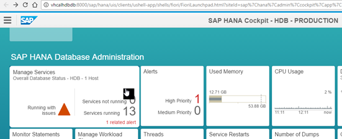

## Prerequisites  
 - **Systems used:** SAP HANA SPS12, SAP HANA, express edition

## Next Steps
 - [View all How-Tos](http://www.sap.com/developer/tutorial-navigator.how-to.html)

## How-To Details
When attempting to log in to the XS Advanced engine from the XS Advanced Client, the following error occurs: `Authentication failed. UAA at http://your-host:30030 uaa-security is not up.`

The error occurs when trying to log in to XS in HANA using the XS Advanced Client with command `xs login –a http://hostname:30030`.

There seem to be plenty of root causes for this issue, involving different components and, of course, different possible solutions. This How-To document covers some of the common root causes and how to identify them.

### Time to Complete
**20 Min**.

---

[ACCORDION-BEGIN [Step 1: ](Make sure UAA is up)]
Discard the obvious first and make sure the service is running.

Open the SAP HANA Cockpit and scroll to the SAP HANA Database administration:

Manage Services:

Find `xsuaaserver` in the list.

[ACCORDION-END]

[ACCORDION-BEGIN [Step 2: ](Ensure all components are up to date, including the XSA Client)]

Not having the latest version of the XSA Client can also be the cause for the `uaa-security is not up` error. You can find the latest version of SAP Web IDE and XSA Client from the [marketplace](https://launchpad.support.sap.com/#/softwarecenter/template/products/_APP=00200682500000001943&_EVENT=DISPHIER&HEADER=N&FUNCTIONBAR=Y&EVENT=TREE&TMPL=INTRO_SWDC_SP_INMEMORY&V=MAINT&REFERER=CATALOG-PATCHES&ROUTENAME=products/By%20Category%20-%20SAP%20In-Memory%20).

[ACCORDION-END]

[ACCORDION-BEGIN [Step 3: ](Make sure the proper access is granted to the user you are logging in with)]

Lack of proper access will lead to even more notable errors, such as an `XSA not authorized` error.  As of SPS12, Patch 1, you will need to assign the right role collections to the user you are connecting with

<ol type="1">
  i. To create role collection:
    <ol type="a">
    <li>Open to Application Role Builder tile </li>
    <li>Press on the menu button on the left upper corner. Choose Role Collection. </li>
    <li> Press on the **+** sign on the right bottom to create a new Role Collection. </li>
    <li> Provide the name (e.g. WebIDE_Developer, WebIDE_Administrator) and assign Application Role:
        <ol type="-">
        <li>WebIDE_DEVELOPER role collection, select app name - webide!1, role template = application role - WebIDE_Developer   </li>
       <li> WebIDE_ADMIN role collection, select app name - webide!1, role template = application role - WebIDE_Administrator </li>
          </ol>
          </li>
      <li> Save </li>
                </ol>

    ii.	Assign Role Collection to a user
      <ol type="a">
      <li> Open User Management tile </li>
      <li> Select a user </li>
      <li> Got to Role Collection section -> add WebIDE_xxxx role collection accordingly </li>
        </ol>
</ol>

You can find more details here: https://blogs.sap.com/2016/08/16/sap-web-ide-for-sap-hana-sps-12-patch-1-tips-and-tricks/

Alternatively, you can test these steps by copying the preconfigured user into a new one, applying the proper role collections and enabling the access to the space with command `xs set-space-role`.

[ACCORDION-END]

[ACCORDION-BEGIN [Step 4: ](Check the right ports are open)]

If you look at the message thrown by the client, you will find that although you explicitly call port 30030 in the `API_URL` parameter, the error message returns port 30032.  Not having the right ports open would mean more errors when trying to connect to other sites, as login requests will go through the UAA.

This means we need to make sure communications into those ports are free of blocks:

<ol type="a">
<li>  Make sure the instance has the proper ports enabled. In CAL, the configuration would look like this for this scenario from `Access points` section in the Virtual Machines tab: 

 
    </li>

  <li> If you are running behind a local or corporate firewall, VPN and/or proxy, make sure traffic is coming in and out.

  There are some quick ways to check network traffic is flowing freely without installing complex tools. The following commands can be executed from a terminal or command prompt and can help uncover a network issue:
  <ol type="i">
    <li> - ping `hostname`, e.g: <i> ping http://vhcalhdbdb </i>  
      If, for example, you forgot to configure your hosts file, the host name will not get resolved and you will get a message similar to `Ping request could not find host xxxxx. Please check the name and try again`. Please remember to configure your hosts file with the reachable, external IP of the server. </li>

    <li> - telnet  `hostname  port`, e.g., <i> telnet  google.com  80 </i>  
      If the connection is somehow unavailable, you will get a message similar to <i> Could not open connection to the host, on port 22: Connect failed </i>. Any other message probably means that the server and port are reachable, although not all servers and ports are available for telnet. A `Connect failed` clearly indicates the connection cannot be established. </li>  </ol>

      </li>

</ol>

[ACCORDION-END]

[ACCORDION-BEGIN [Step 5: ](Check the Hostname)]
If you recently performed an upgrade, **make sure the hostname and Fully Qualified Domain Name (FQDN) are still correct**. The file /etc/hosts in the operating system of the HANA instance contains this information

[ACCORDION-END]

## Next Steps
 - [View all How-Tos](http://www.sap.com/developer/tutorial-navigator.how-to.html)
