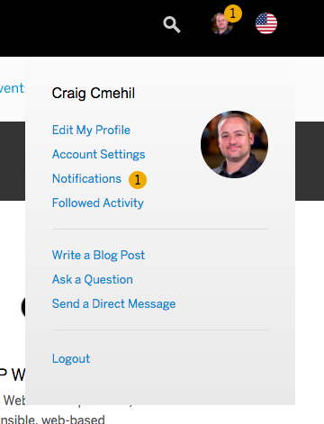
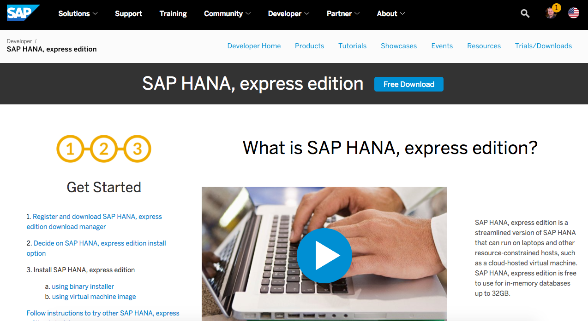
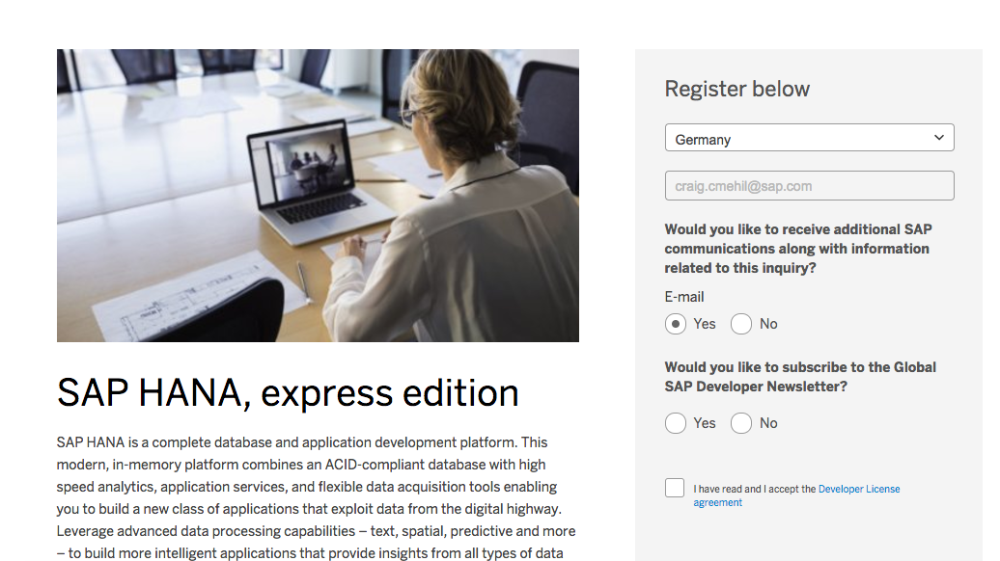

## Prerequisites  
 - **Systems used:** SAP HANA 2.00 SPS1, SAP HANA Express Edition

## Next Steps
 - [View all How-Tos](http://www.sap.com/developer/tutorial-navigator.how-to.html)

## How-To Details
The following will document links, tips and tricks and more related to the SAP CodeJam Getting Started with HXE event.

### Time to Complete
**5 to 6 Hours**.

---

[ACCORDION-BEGIN [Step 1: First steps after registering to attend the event](First steps after registering to attend the event)]

Now that you have registered for the [SAP CodeJam](https://www.sap.com/developer/events.html) event you will need to follow a few steps here to prepare yourself for the event.

The first step is of course to sign up and register for [SAP.com](http://developers.sap.com) this will enable your user and make future steps much easier.

Now proceed to [SAP HANA, express edition](https://www.sap.com/developer/topics/sap-hana-express.html) product page where you will see the steps listed as well as more information on what exactly HXE is.

> Remember you will need a laptop or machine with at least **12 GB** of ram as the virtual machine requires **8 GB** of ram - we will focus on the `Server Only` image during the event. You can also choose a cloud provider but please note those require a credit card to sign up for most.

[ACCORDION-END]

[ACCORDION-BEGIN [Step 2: Get your version HXE](Get your version HXE)]

In order to get your copy of the download, either the virtual machine or the binaries to install on your own Linux installation you will need to [register](https://www.sap.com/cmp/ft/crm-xu16-dat-hddedft/index.html).

[ACCORDION-END]

[ACCORDION-BEGIN [Step 3: Get your VM software](Get your VM software)]

While you begin to download your image or the binaries, again we are focused on the `Server Only` image during the event. You should head over to [Google](http://www.google.com) and search for a VM player for your system unless you are running a Linux install and plan to install the binaries directly.

For Windows we recommend the VMware Workstation Player which is a free offering and for Mac OS X we recommend Virtual Box. But the choice is entirely up to you.

[ACCORDION-END]

[ACCORDION-BEGIN [Step 4: Import your OVA or install your binaries](Import your OVA or install your binaries)]

Once you have the VM installed and your download is complete you will need to "open" your image via the VM software which will result in an import taking place.

If you chose the option to download the binaries instead you will need to follow the steps require for installing the system from scratch. You can also check out the [following guide](https://blogs.sap.com/2017/02/07/hana-express-edition-on-google-cloud-platform-and-ubuntu/) which walks your through the process.

> At this point you can can continue with steps 5, 6 but remember to follow the steps from the PDF that came with your download on what you need to do the first time you start the system. or you can wait until the day of the event and we will help you through steps 5, 6, 7 and 8.

[ACCORDION-END]

[ACCORDION-BEGIN [Step 5: Download Eclipse](Download Eclipse)]

While the import is taking place you will need to download a copy of the Eclipse software which will allow you to add the appropriate plugins to connect to your new HXE server.

We recommend [Eclipse Neon](http://www.eclipse.org/downloads/packages/), the Java EE version in case you later want to explore the SAP HANA Cloud Platform.

[ACCORDION-END]

[ACCORDION-BEGIN [Step 6: Install the Plugins and Connect](Install the Plugins and Connect)]

Now that Eclipse has been installed you will need to add the appropriate plugins. The following guide will take your though [those steps](https://www.sap.com/developer/how-tos/2016/09/hxe-howto-eclipse.html).

Finally you are connected to your HXE system.

[ACCORDION-END]

[ACCORDION-BEGIN [Step 7: Create a new user](Create a new user)]

Before you begin running amok in your system we do recommend you create a new user and not use the `SYSTEM` user.

The [following guide](https://www.sap.com/developer/how-tos/2016/09/hxe-howto-tutorialprep.html) will walk you through those steps. You can name your user anything you like or even create 2 users (including the one from the guide `WORKSHOP_01`)

From this point on we hit the actual `working with HXE` steps and that means a bit of coding, modeling and more.

[ACCORDION-END]

[ACCORDION-BEGIN [Step 8: Coding begins](Coding begins)]

Now that you are connected and have your new users created it is time to actually do a little coding. The following tutorials will walk you through your first project with the Eclipse software and your HXE server.

- [SAP HANA Studio, Setup a new project](https://www.sap.com/developer/tutorials/studio-new-project.html)
- [SAP HANA Studio, Deploy Project](https://www.sap.com/developer/tutorials/studio-deploy-project.html)
- [SAP HANA Studio, Import Data](https://www.sap.com/developer/tutorials/studio-import-data.html)
- [SAP HANA Studio, Display your Application](https://www.sap.com/developer/tutorials/studio-display-project.html)

[ACCORDION-END]

[ACCORDION-BEGIN [Step 9: Advanced System Settings](Advanced System Settings)]

If you are so inclined you can also enhance your current server installation and add in the browser based tooling to forgo the using of Eclipse for working with the server as well.

This [blog post](https://blogs.sap.com/2016/10/28/enhancing-hxe-server-image/) walks you through the whole process of installing the browser based tools.

[ACCORDION-END]

[ACCORDION-BEGIN [Step 10: Coding from the browser](Coding from the browser)]

If you choose to install the browser based tools in Step 9 then you can move on to the following tutorials for creating your first project via that environment.

- [Develop your first SAP HANA XSC Application](https://www.sap.com/developer/tutorials/hana-web-development-workbench.html)
- [Access your first data in a SAP HANA XSC Application](https://www.sap.com/developer/tutorials/hana-data-access-authorizations.html)
- [Enable XSODATA in your SAP HANA XSC Application](https://www.sap.com/developer/tutorials/hana-xsodata.html)
- [Consume XSODATA in your SAP HANA XSC Application](https://www.sap.com/developer/tutorials/hana-consume-xsodata.html)

[ACCORDION-END]

[ACCORDION-BEGIN [Step 11: Personalize HXE](Personalize HXE)]

The following tutorials and blogs are just some optional items to help you understand your HXE install and personalize it a bit to suit you.

- [Custom Login Screen](https://blogs.sap.com/2016/10/31/customize-my-hxe/)
- [`Changing the Default landing page`](https://blogs.sap.com/2016/11/22/hxe-customizing-the-landing-page/)
- [`Enhance the new landing page`](https://blogs.sap.com/2016/11/22/hxe-enhancing-your-custom-landing-page/)

[ACCORDION-END]

[ACCORDION-BEGIN [Step 12: Advanced Topics](Advanced Topics)]

The following items are meant for further exploration of the HXE server and things that are possible with it.

- [Raspberry Pi](https://blogs.sap.com/2017/01/26/tbt-sap-hana-and-raspberry-pi/)
- [Fuzzy Search](https://blogs.sap.com/2016/10/26/hxe-fuzzy-search/)

[ACCORDION-END]

## Next Steps
 - [View all How-Tos](http://www.sap.com/developer/tutorial-navigator.how-to.html)
