## Prerequisites  
1. [How to run SAP Vora on Amazon Web Services](http://www.sap.com/developer/how-tos/2017/02/vora-launch-aws.html) is completed, and
2. SAP Vora instance running with 2/2 status checks passed in the AWS console,
3. The Manager instance is running under a VPC created following the steps in [Create a VPC in AWS for SAP Vora Developer Edition in AWS](http://www.sap.com/developer/how-tos/2017/02/vora-aws-create-vpc.html),
4. The required ports are open. Refer to [AWS Step by Step guide to create Security Group SAP Vora 1.3](http://www.sap.com/developer/how-tos/2017/02/vora-aws-security-groups.html),
5. AWS Access key and secret key,
6. Google Chrome (version 24 or higher)

## Next Steps
 - Return to the [SAP Vora Developer](https://www.sap.com/developer/topics/vora.html) Page

## How-To Details
This How-to is a step-by-step guide to setting up and administering an SAP Vora 1.3 Cluster

### Time to Complete
**20 Min**.

---

[ACCORDION-BEGIN [Step 1: ](Check required ports)]

Open required ports in the `edit inbound rules` dialog in AWS.

[DONE]
[ACCORDION-END]

[ACCORDION-BEGIN [Step 2: ](Connect to your instance)]

Copy the public IP address of the AWS instance from the address bar in Chrome.

Click on **Advanced** and accept the certificate.

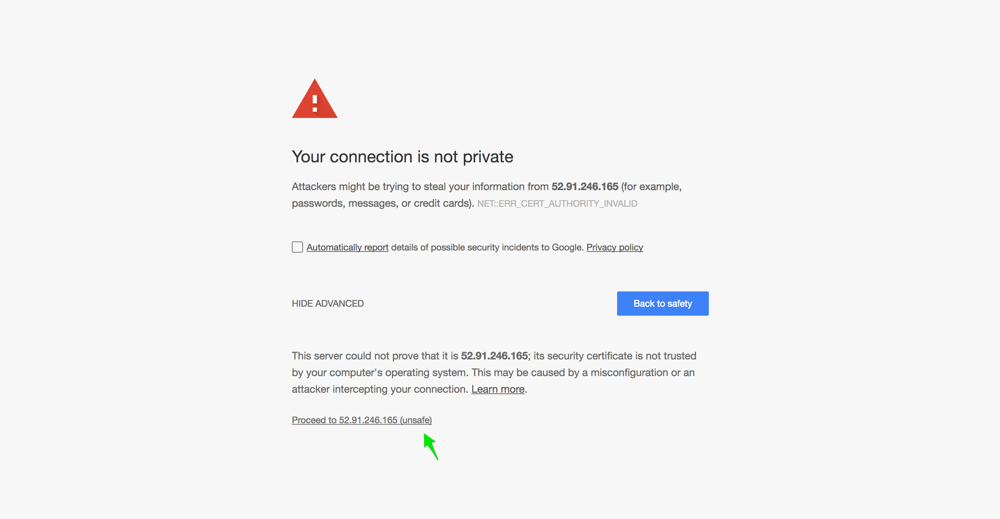

Enter the AWS access key id and the access secret key. If the keys are valid, you will be moved to the next step.

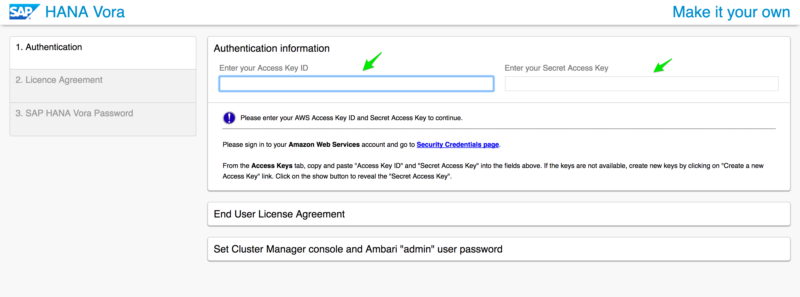

Read the End User License Agreement and accept it to proceed further

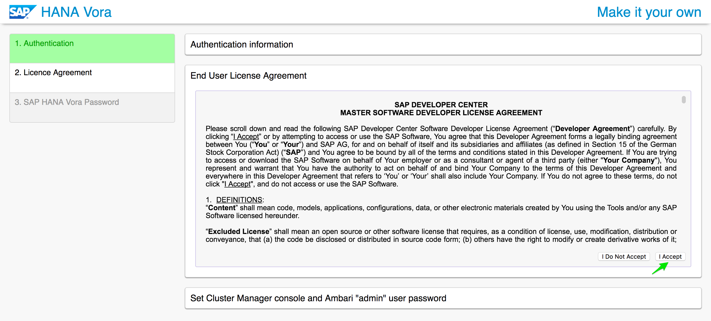

[DONE]
[ACCORDION-END]

[ACCORDION-BEGIN [Step 3: ](Set up SAP Vora)]

Enter the console password and click **Set up SAP Vora!**. This checks to see if the prerequisites to set up the cluster are met and shows the status if not met.

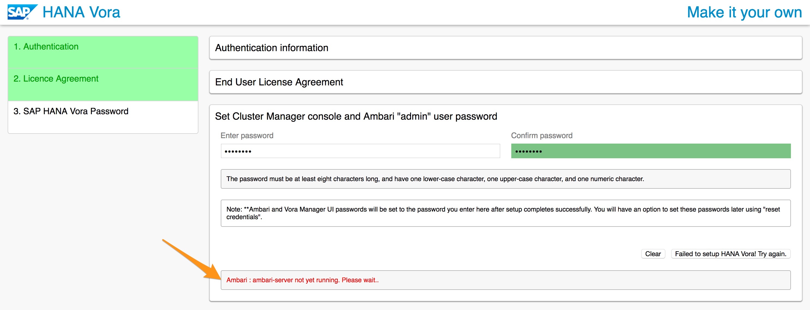

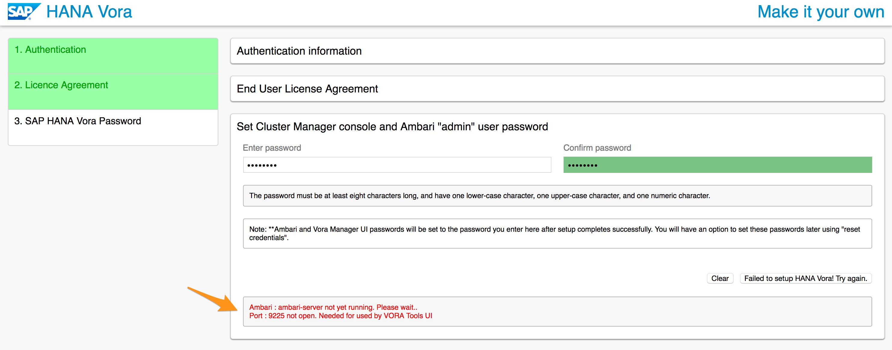

Take action on the messages shown in red and click on the button again; for example if port/s are not open, open the security group ports as needed. Refer to the "AWS Step by Step guide to create Security Group SAP Vora 1.3".  `Ambari` server takes a while to start running, so in this case it is good to wait for few minutes. `Ambari` server status can be also checked by doing SSH to the Manager instance and checking the `Ambari` server status.

The steps above are needed only for first-time setup. Later, the console password can be used to access the cluster to log in.

Data node/s can be added using Add Node button.

[DONE]
[ACCORDION-END]

[ACCORDION-BEGIN [Step 4: ](View the cluster management console)]

Click on the **Set up SAP Vora!** button to open the cluster management console. The console shows four nodes (`Manager`, `Master`, `Worker`, `Worker2`) being launched. The Messages section shows the status of the configuration.

The host and services status can be viewed in the list of instance cards. For each node card, the top bar shows the status of node in the cloud and bottom bar shows the status of node in terms of `Ambari` and Vora services.

Once all four nodes are up and running your optimal cluster is ready for use.

For Vora 1.3, the cluster consists of four basic nodes, which form this optimal cluster.  This cluster can be used as is for loading data. More data nodes can be added as needed.

The four nodes are:

  1. Manager: (`Ambari`) + `Vora Thrift server` and `Vora tools`, `Vora Dlog server`
  2. Master: `HDFS`, `Vora landscape`, `Vora txbroker`, `Vora txcoordinator`, `vora txlocker`, `Vora catalog server`, `Vora Dlog server`
  3. Worker: `HDFS`, `Vora disk`, `Vora Dlog server`, `Vora docstore`, `Vora graph`, `Vora timeseries`,  `Vora v2server`.
  4. Worker 2: `HDFS`, `Vora disk`, `Vora docstore`, `Vora graph`, `Vora timeseries`, `Vora v2serries`

It is recommended that all the services on these nodes are up and running for proper functioning of the Vora cluster. Data node/s can be added by using the **Add Node** button.

[DONE]
[ACCORDION-END]

[ACCORDION-BEGIN [Step 5: ](View configuration)]

The configuration status is visible in the Console.
The Configuration process can be cancelled by hitting **Force Cancel**, though it is not advised that you cancel configuration.

In case of configuration failure, retry using the **CONFIGURE** button.

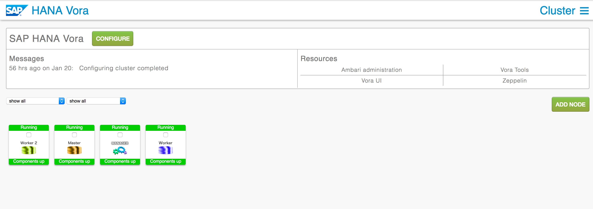

[DONE]
[ACCORDION-END]

[ACCORDION-BEGIN [Step 6: ](Log in to the Apache Ambari console)]  

Log in to the Apache Ambari console at `http://<public ip of Manager>:8080`. The credentials for Ambari are   `admin:<console password which was set in the setup phase>`.

[DONE]
[ACCORDION-END]

[ACCORDION-BEGIN [Step 7: ](Vora Manager UI)]

Click on the Vora UI under resources or enter `http://<publicip>:19000` in the browser to open the Vora Manager UI. The nodes tab lists the set of instances in the cluster and the services running in each.

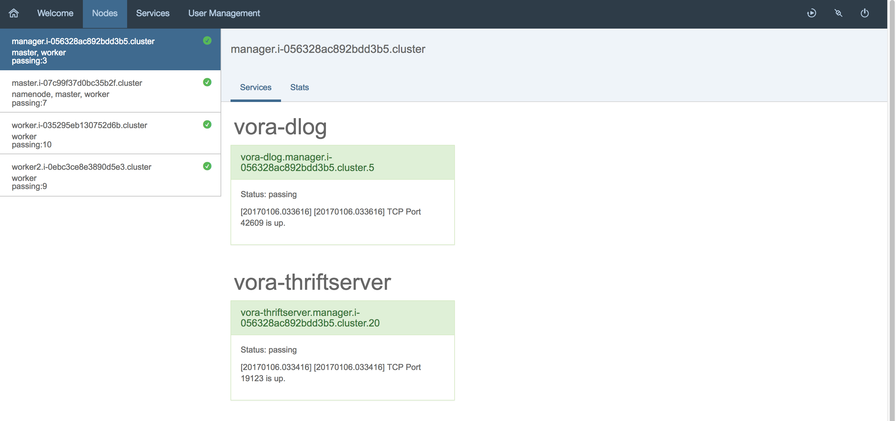

The services tab lists each of the services with its configuration and node assignments.

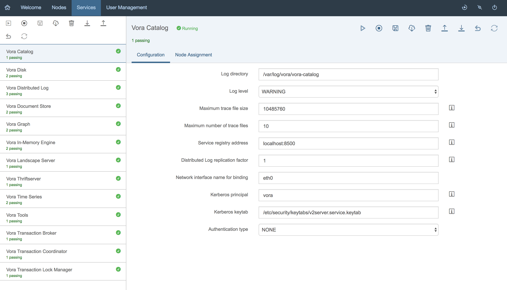

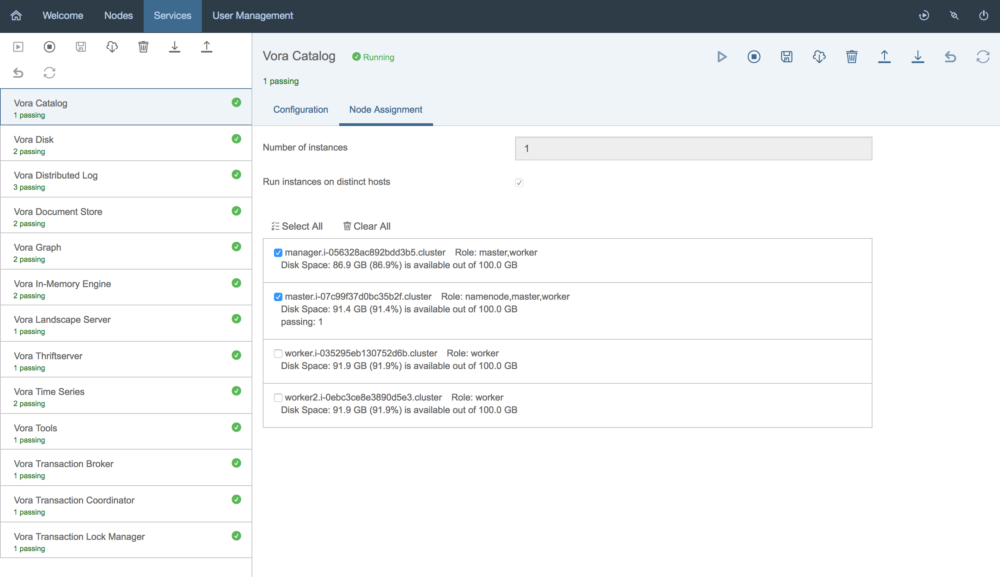

[DONE]
[ACCORDION-END]

[ACCORDION-BEGIN [Step 8: ](Vora Tools)]

Vora Tools can be accessed via the link on SAP Vora Console page or at `http://<public ip of manager instance>:9225`.

The credentials for Vora Tools are `admin:<console password which was set in the setup phase>`.

[DONE]
[ACCORDION-END]

[ACCORDION-BEGIN [Step 9: ](Zeppelin)]

Click on **Zeppelin** under resources or enter `http://<publicDNS>:9099` in the browser to open the Vora Manager UI. Click on **Create new note** to create a new notebook.

Add Data node or nodes. One or more data nodes can be launched using the **ADD NODE** button. The node card appears with flashing green header. This node gets added to the cluster automatically.

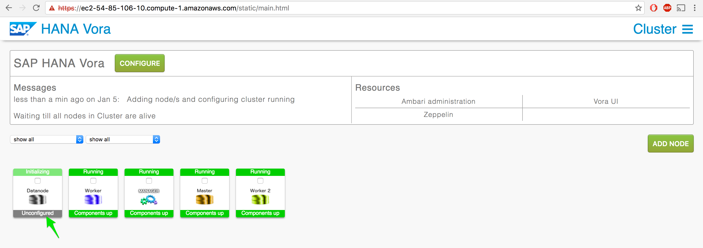

View instance and node details by clicking the respective cards.

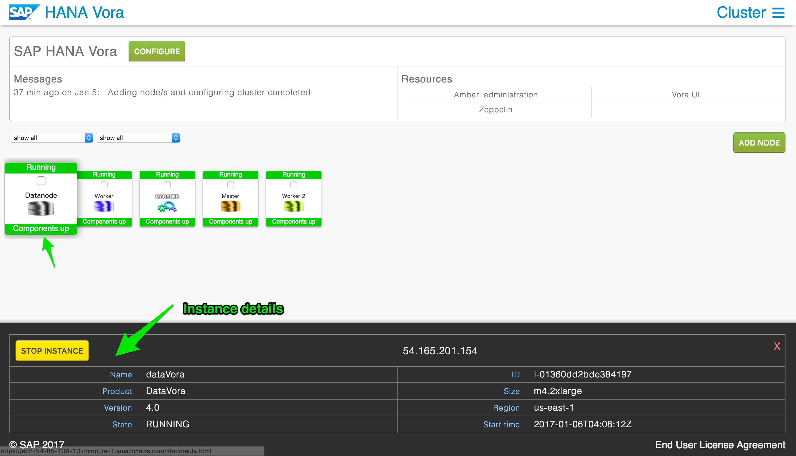

Click on **STOP INSTANCE** to stop the running instances. Once an instance is stopped, the top of the card shows the status as STOPPED.

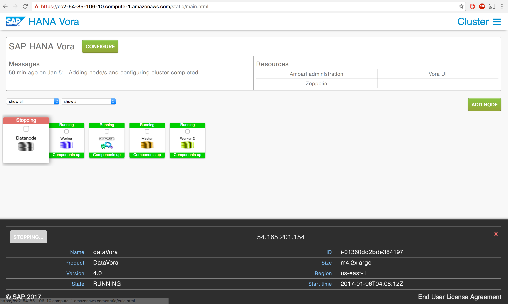

Similarly, instances or nodes can be started or deleted by clicking the **START INSTANCE** and **DELETE NODE** buttons, respectively. Delete Node is not fully supported in this version if the nodes contain data.

  > Note: Before deleting the node from the console it has to be removed from Ambari.

If the node has been removed from the Ambari and if its still available in the cloud as a valid supported node type, the node can be configured by clicking on the configure instance as shown below:

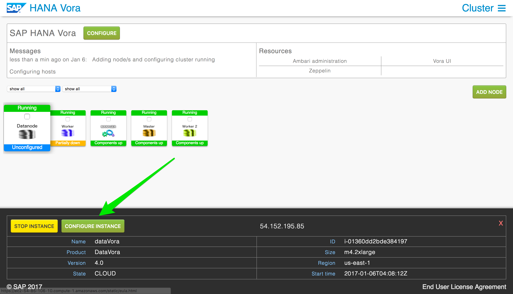

[DONE]
[ACCORDION-END]

[ACCORDION-BEGIN [Step 10: ](Manage unmanaged nodes)]

If Ambari shows an additional node currently not being managed by the cluster, it is shown as Unmanaged. Click on the **MANAGE** button and start managing it.

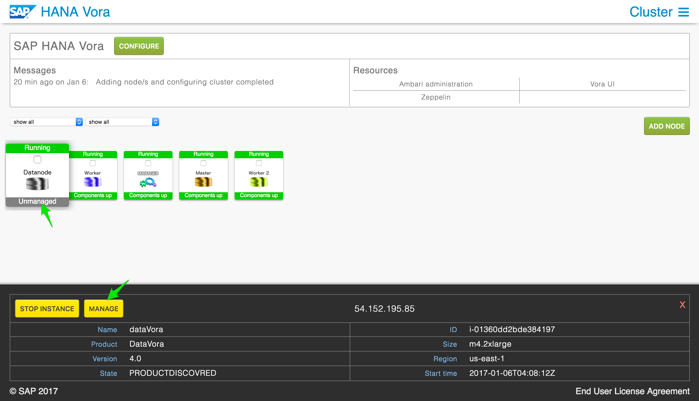

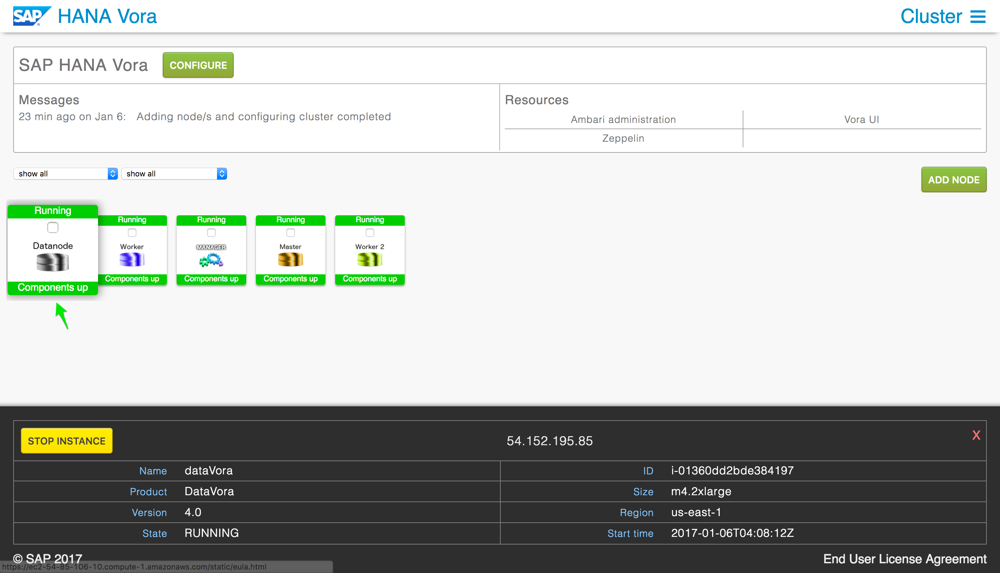

[DONE]
[ACCORDION-END]

[ACCORDION-BEGIN [Step 11: ](Updates in Vora console)]

To reset console password, click Menu -> Update Credentials in the top-right corner of the window. Enter the AWS access and secret keys. Enter the new password twice. The Ambari admin password and the Vora Manager admin password are updated with the console password.

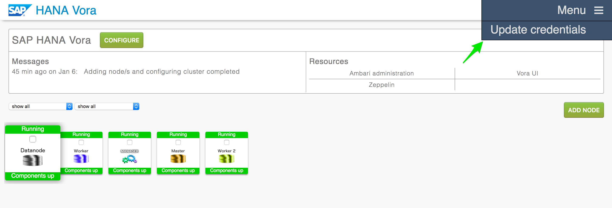

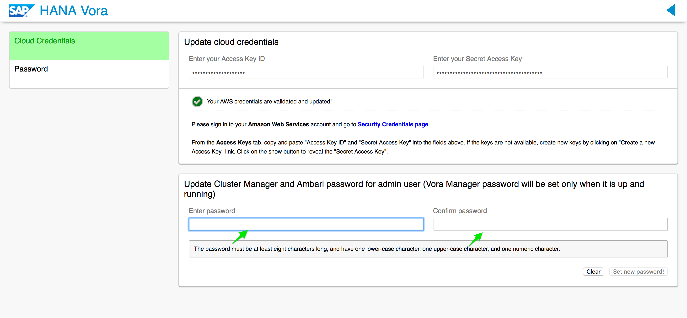

For SAP Vora console software updates, click **RESTART TO UPDATE NOW**. The update can also be ignored. It is recommended that you do not install updates while any configuration is happening.

[DONE]
[ACCORDION-END]

## Next Steps
- Return to the [SAP Vora Developer](https://www.sap.com/developer/topics/vora.html) Page
