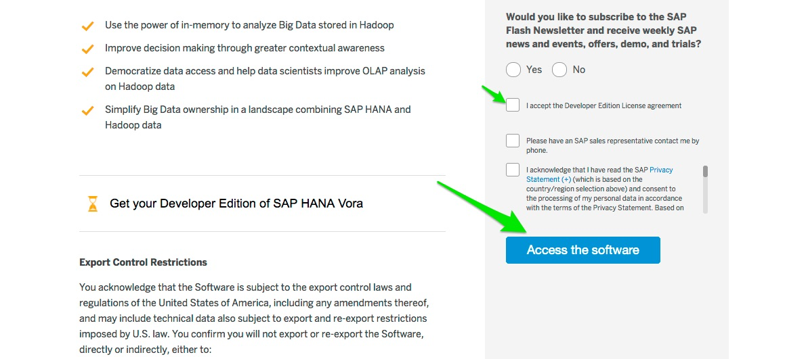
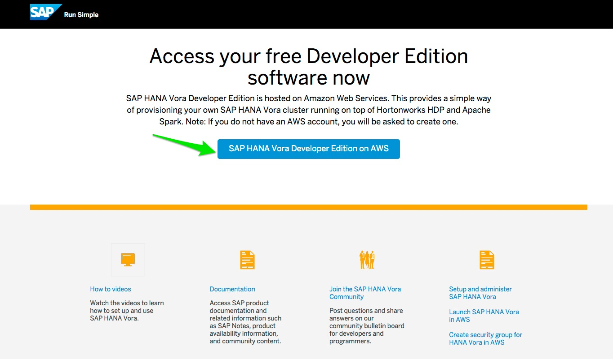
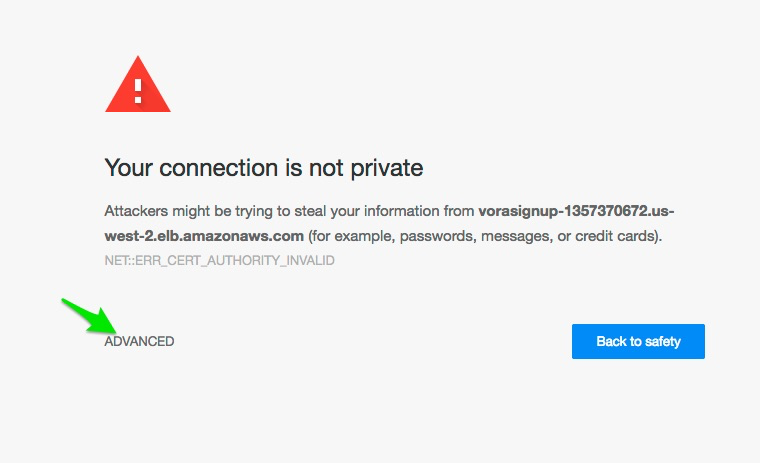
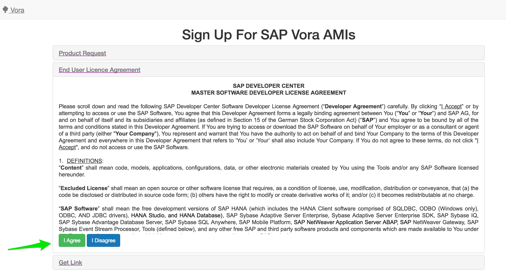
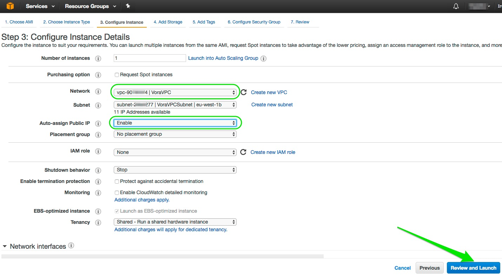
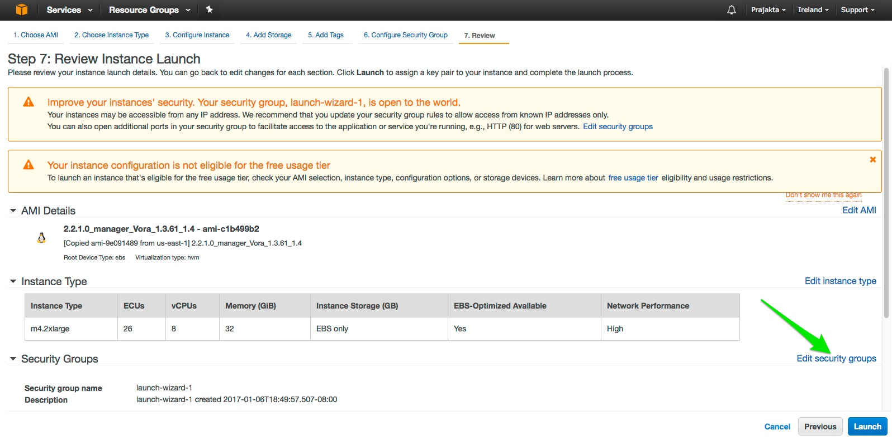
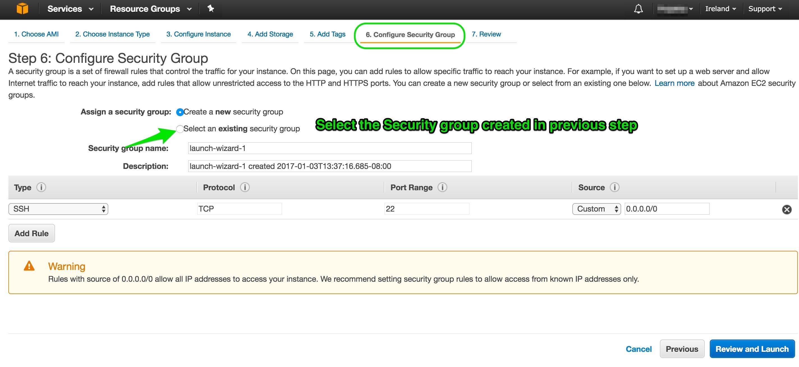
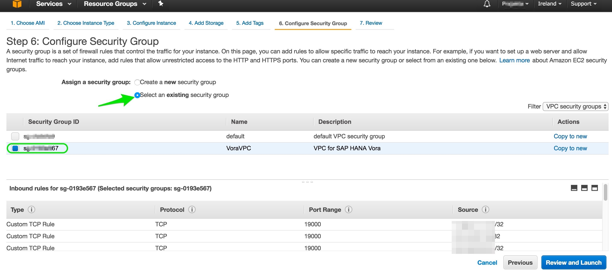
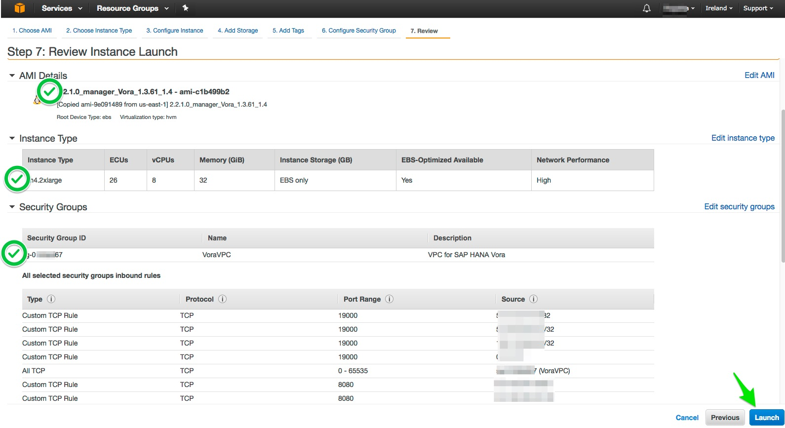
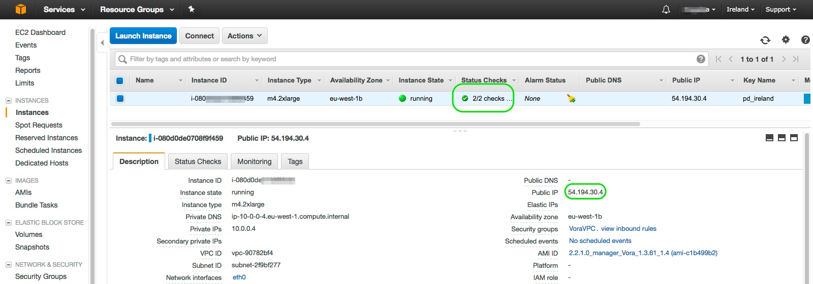

## Prerequisites

   1. Amazon Web Services account. Create AWS account or use existing account.
   2. SSH key pair. Refer to the [Amazon documentation](http://docs.aws.amazon.com/AWSEC2/latest/UserGuide/ec2-key-pairs.html). Store the `pem` file in safe location. For windows generate a `.ppk` file using `putty-gen`.
   3. AWS credentials. Create active Access and Secret Key and store CSV  in a safe location to be used later. Refer to the [Amazon documentation](http://docs.aws.amazon.com/AWSSimpleQueueService/latest/SQSGettingStartedGuide/AWSCredentials.html).
   4. VPC setup. Refer to [Create a VPC in AWS for SAP Vora Developer Edition in AWS](http://www.sap.com/developer/how-tos/2017/02/vora-aws-create-vpc.html)
   5. AWS Security Group for Vora Cluster. Refer to [Set up Security Groups in AWS VPC for SAP Vora](http://www.sap.com/developer/how-tos/2017/02/vora-aws-security-groups.html) for the steps.

## Next Steps
 - [ SAP Vora Cluster Setup and Administration on AWS] (http://www.sap.com/developer/how-tos/2017/02/vora-aws-cluster-setup.html)

## How-To Details
This How-to is a step-by-step guide for launching SAP Vora Developer Edition in AWS on Vora 1.3.

### Time to Complete
**20 Min**.

---

[ACCORDION-BEGIN [Step 1: ](Vora sign-up)]

 Visit the [SAP Vora Sign-up](https://www.sap.com/cmp/syb/crm-xu15-int-voratrdm/index.html) page to sign up for the SAP Vora Developer Edition for AWS.

Register for the SAP Vora Developer Edition. Enter the necessary details.

Access the SAP Vora Developer Edition. There are some useful videos and documentation links at the page shown in the following  image.

After clicking on **SAP Vora Developer Edition on AWS**, in the browser, the following privacy error is displayed. Choose the advanced settings.

Choose **Proceed to Vora sign-up...** to ignore the privacy error.

Enter the user details and select the product from the product list and choose the AWS region.

Read and accept the EULA

Get the link to the Image (AMI) in the AWS console

[DONE]
[ACCORDION-END]

[ACCORDION-BEGIN [Step 2: ](Launch manager instance in AWS)]

Click the link for SAP Vora AMI, right click on the image and click **Launch**.

Enter the required details and choose the AWS region in which you wish to launch the cluster.

Accept the End User License Agreement to get the link to the AMI.

The ID is shown here:

[DONE]
[ACCORDION-END]

[ACCORDION-BEGIN [Step 3: ](Configure instance details)]

Select the AWS instance type `m4.2xlarge` and click on **Next : Configure Instance Details**. For Network, choose the VPC created earlier and enable "Auto-assign Public IP". Click **Review and Launch**.

Edit the Security Group and choose the Security group created earlier.

[DONE]
[ACCORDION-END]

[ACCORDION-BEGIN [Step 4: ](Launch instance)]

Launch the instance after verifying all the selections by clicking **Launch**.

Choose the SSH key pair. If none exists, create one and store it safely for connecting to the instance using SSH.

Click on **Launch Instances**.

[DONE]
[ACCORDION-END]

[ACCORDION-BEGIN [Step 5: ](View the instance)]

View the instance status in the console. Wait until the instance status check shows 2/2 checks passed.

Now the SAP Vora instance is ready for cluster configuration and management.

[DONE]
[ACCORDION-END]

## Next Steps
 - [ SAP Vora Cluster Setup and Administration on AWS] (http://www.sap.com/developer/how-tos/2017/02/vora-aws-cluster-setup.html)
