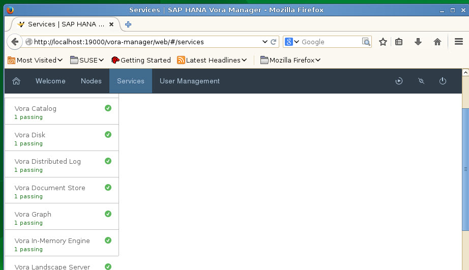

## Prerequisites  
 - **Software required:**
   - Personal computer with a compatible hypervisor, like VMware Workstation Player

## Next Steps
- [Using Apache Zeppelin with SAP Vora](http://www.sap.com/developer/tutorials/vora-cal-zeppelin0.html)

## How-To Details
This How-to details the procedure to download, install and verify SAP Vora version 1.3 developer edition packaged as a virtual machine appliance.

SAP Vora, developer edition, is covered by the Developer License Agreement, which you will need to accept in order to be able to get access to it.

>SAP Vora is a software working in the **distributed environment**, i.e. the one that usually consists of at least several computing nodes. But in case of the **developer edition** the SAP Vora software has been modified to allow you to practice with a single node instance.

### Time to Complete
**35 Min**.

---


[ACCORDION-BEGIN [Step 1: ](Download the OVA File)]

Request the free virtual machine image (the `.ova` file) of SAP Vora 1.3, developer edition from the SAP Store:

https://store.sap.com/sap/cp/ui/resources/store/html/SolutionDetails.html?sap-language=EN&pid=0000014484

You need to have free registration at SAP Store. Once the product is requested you will receive an e-mail with the link to download an archive file with `.ova` file in it. The size of an archive file is about 3GB.

[DONE]
[ACCORDION-END]


[ACCORDION-BEGIN [Step 2: ](Install a hypervisor)]

VMware Workstation Player is a hypervisor compatible with SAP Vora 1.3, developer edition. You can install any supported hypervisor, but examples in this how-to use VMware Workstation Player.

Download VMware Workstation Player from <http://www.vmware.com>, run the installer and register when prompted.

> Ensure you are downloading the correct version for your development machine.

[DONE]
[ACCORDION-END]


[ACCORDION-BEGIN [Step 3: ](Import the downloaded OVA file)]

Open the VMware Workstation Player and in the menu choose **`Player > File > Open`**, select the SAP Vora OVA file and click **Open**, then click **Import**.

The import process will take a few minutes.

[DONE]
[ACCORDION-END]


[ACCORDION-BEGIN [Step 4: ](Change the network settings of the virtual machine)]

You need to change the network settings before starting the virtual machine for the first time.

Choose **`Player > Manage > Virtual Machine Settings > Network Adapter`**, select the **Host-only** option and click **OK**.

You have now imported the OVA image and changed the network settings. As of now, the virtual machine is in the host-only network, so you cannot connect to the Internet from inside the virtual machine.

[DONE]
[ACCORDION-END]


[ACCORDION-BEGIN [Step 5: ](Start the virtual machine)]

Choose **Play virtual machine**. After some time you will see the login screen. Enter the credentials below and click **Log In**.

|Field Name     | Value                            |
|---------------|----------------------------------|
| **user name** | `vora`                           |
| **password**  | `vora`                           |

[DONE]
[ACCORDION-END]


[ACCORDION-BEGIN [Step 6: ](Reset default passwords)]

For security reasons, you should change the default passwords for `vora` and `root` users.

To do this, open a terminal in the virtual machine and:
- Execute  `passwd`  and type your new password for the user `vora` two times
- Execute  `su`  and type the default password for the `root` user: `root`
- Execute  `passwd`  and type your new password for the user `root` two times
- Execute  `exit`  so you're again acting as user `vora`


[DONE]
[ACCORDION-END]


[ACCORDION-BEGIN [Step 7: ](Make a note of your IP address)]

You need to know your IP address to connect to Vora services. In the terminal execute the command below:

```bash
/sbin/ifconfig eth0
```

Note the IP address after `inet addr:`. It is referred to as `IP_ADDRESS` in the rest of this document.


[DONE]
[ACCORDION-END]


[ACCORDION-BEGIN [Step 8: ](Open SAP Vora Manager)]

In the virtual machine start Firefox web browser. Open the Vora Manager at `http://localhost:19000`, log in with the user `admin` and the password `admin`. Choose the **Services** tab.

You should see that all SAP Vora services have a green check mark, indicating that they have been started and are running correctly.



[DONE]
[ACCORDION-END]

[ACCORDION-BEGIN [Step 9: ](Open SAP Vora Tools)]

Use Firefox to open the SAP Vora Tools web application from `http://localhost:9225`

The user is `admin` and the password is `admin`.

> Note: Some features in the Vora Tools need a more recent browser than Firefox that runs in the virtual machine image. Use the web browser on the host machine instead and connect to `http://IP_ADDRESS:9225` to have best experience and performance with SAP Vora Tools.

[DONE]
[ACCORDION-END]


[ACCORDION-BEGIN [Step 10: ](Install the VMWare tools)]

VMware Tools is a suite of utilities that enhances the performance of the virtual machine's guest operating system and improves management of the virtual machine.

Select **`Player > Manage > Install VMware Tools`**, then open the terminal and execute the following:

```bash
cp /media/VMware Tools/VMwareTools* ~
cd ~
tar -xf VMwareTools*
sudo ./vmware-tools-distrib/vmware-install.pl --default
```

The installation process will take a few minutes. It will use default settings with no further user input required.

[DONE]
[ACCORDION-END]


[ACCORDION-BEGIN [Step 11: ](Share the folder from the host system)]

Select **`Player > Manage > Virtual Machine Settings > Options > Shared Folders`**.

Change **Folder sharing** to `Always enabled` and click **Add**. In the wizard browse the host system folder you want to share with your VM and provide the name under which it will be visible.

In the example `C:\Users\I076835\Documents\Virtual Machines\Shared with VMs` is shared as `shared_from_host`


Now you can see shared folder from the host machine under `/mnt/hgfs/`path.


For example if you want to copy some files with data from your host machine to `HDFS` storage backend in the VM use:

```bash
hdfs dfs -put /mnt/hgfs/shared_folder/some_file /user/vora/
```

[DONE]
[ACCORDION-END]

## Next Steps
- [Using Apache Zeppelin with SAP Vora](http://www.sap.com/developer/tutorials/vora-cal-zeppelin0.html)
