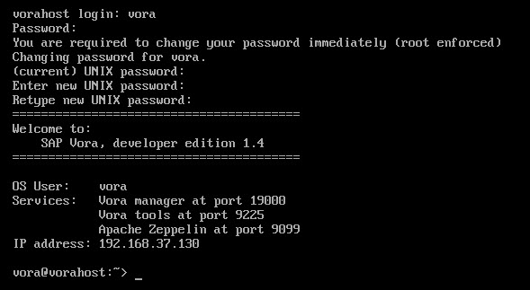
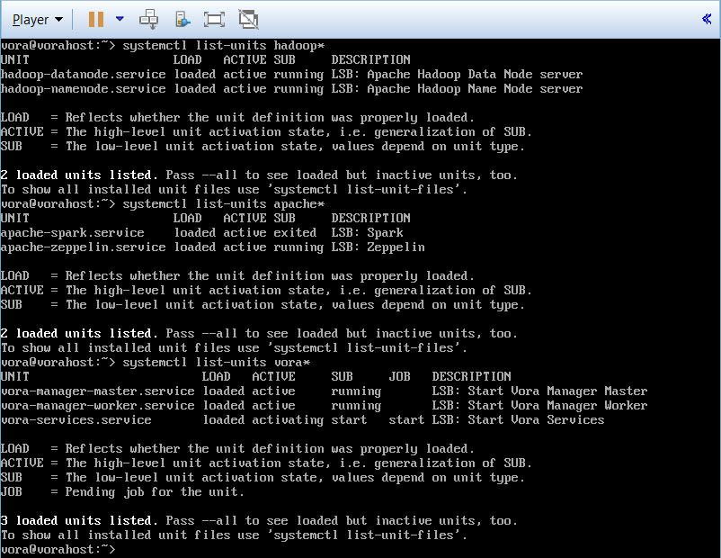
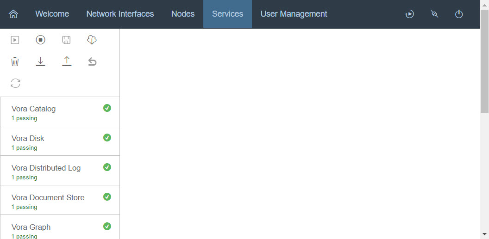
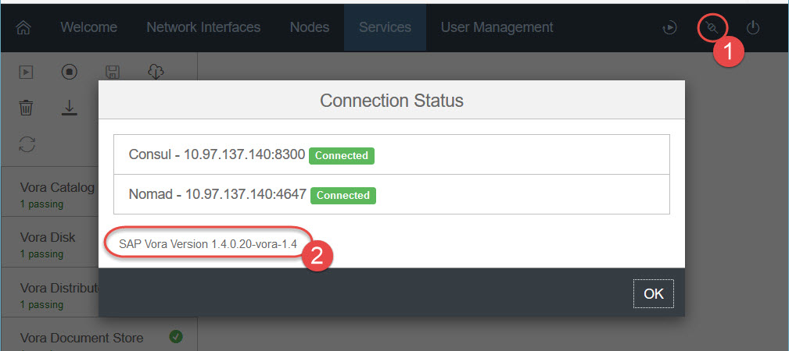
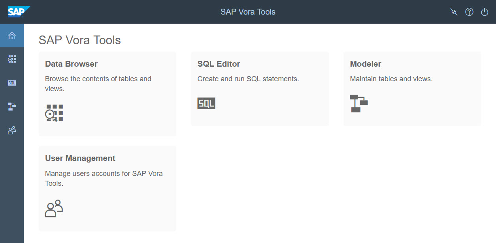
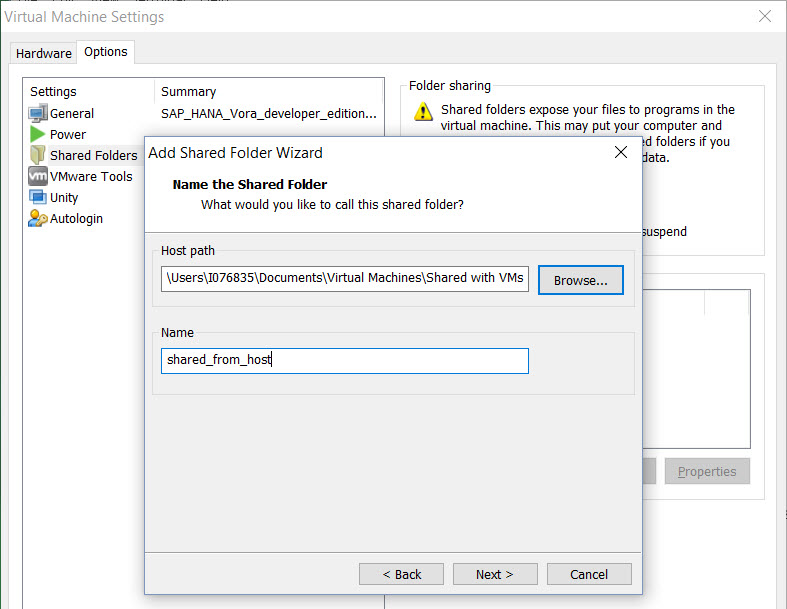

## Prerequisites  
 - **Software required**
   - Personal computer with a compatible hypervisor, like VMware Workstation Player

## Next Steps
 - [Getting started with SAP Vora 1.4 virtual machine](https://www.sap.com/developer/groups/vora-ova-get-started.html)

This How-to details the procedure to download, install and verify SAP Vora version 1.4 developer edition packaged as a virtual machine appliance. SAP Vora, developer edition, is covered by the Developer License Agreement, which you will need to accept in order to be able to get access to it.

>SAP Vora is a software working in the **distributed environment**, i.e. the one that usually consists of at least several computing nodes. But in case of the **developer edition** the SAP Vora software has been modified to allow you to practice with a single node instance.

Refer to the last section of this How-to for most common troubleshooting activities. If solution is not available there, then:
 - Post a question on [SAP Community Answers](https://answers.sap.com/tags/73555000100800000134) if you have SAP Community account,
 - Post a question on [Stack Overflow](https://stackoverflow.com/questions/tagged/vora) if you have an account there,
 - Open an internal ticket in SAP Customer Support System using `HAN-VO` component if you are an SAP employee.

### Time to Complete
**35 Min**.

---


[ACCORDION-BEGIN [Step 1: ](Download the OVA File)]

Sign up for and request the free virtual machine appliance (the `.ova` file) of SAP Vora 1.4, developer edition from the SAP Store by clicking on **Trial Version** button on:

https://store.sap.com/sap/cp/ui/resources/store/html/SolutionDetails.html?sap-language=EN&pid=0000014484

You need to have free registration at SAP Store.

Once the product is requested you will receive an e-mail with the link to download an archive file with `.ova` file in it. The size of an archive file is about 2GB.

[DONE]
[ACCORDION-END]


[ACCORDION-BEGIN [Step 2: ](Install a hypervisor)]

VMware Workstation Player is a hypervisor compatible with SAP Vora 1.4, developer edition. You can install any other supported hypervisor, like VirtualBox, but examples in this how-to are based on the VMware Workstation Player.

Download VMware Workstation Player from <https://my.vmware.com/en/web/vmware/free#desktop_end_user_computing/vmware_workstation_player/12_0>, run the installer and register when prompted.

>Ensure you are downloading the correct version for your development machine.

[DONE]
[ACCORDION-END]


[ACCORDION-BEGIN [Step 3: ](Import the downloaded OVA file)]

Open the VMware Workstation Player and in the menu choose **`Player > File > Open`**, select the SAP Vora `.ova` file. Click **Open** and then **Import**.

The import process will take a few minutes.

[DONE]
[ACCORDION-END]


[ACCORDION-BEGIN [Step 4: ](Start the virtual machine)]

Choose **Play virtual machine**.

>VMware Player console takes over control over keyboard and mouse. `Ctrl+Alt` takes focus away from the console and allows you to work with other applications on the host machine.
>You can open up to and switch between 6 terminal screens using `Ctrl+Alt+F1` (default one) through `Ctrl-Alt+F6`.

Enter the credentials below when see logon screen.

|Field Name     | Value                            |
|---------------|----------------------------------|
| **user name** | `vora`                           |
| **password**  | `VDEVora1`                       |

The first time you login as user `vora` you will be asked to change your password. Make sure you remember the new password.



>Please note that the default keyboard layout for this virtual machine is ___English (US)___ (`qwerty`). You may want to adjust it for your layout by starting YaST tool with `sudo yast` command, and then going to **Hardware** > **System Keyboard Layout**.

[DONE]
[ACCORDION-END]


[ACCORDION-BEGIN [Step 5: ](Reset default passwords)]

For security reasons, you should change the default passwords for `root` user.

- Execute  command `su`  to switch to the `root` user
- Type the default password for the `root` user: `VDEVora1`
- You will be asked to enter and retype the new password for `root` user
- Execute  `exit`,  so you're again acting as a user `vora`


[DONE]
[ACCORDION-END]


[ACCORDION-BEGIN [Step 6: ](Check SAP Vora services are booted)]
It takes a few minutes for SAP Vora services to initialize. To check status of initialization execute the command
```sh
systemctl list-units vora*
```

You should see Vora Manager's Master and Worker services as "running".


[DONE]
[ACCORDION-END]


[ACCORDION-BEGIN [Step 7: ](Open SAP Vora Manager)]
You need to know your IP address to connect to Vora services. In the terminal execute the command below:

```sh
/sbin/ifconfig eth0
```

Note the IP address after `inet addr:`. It is referred to as `IP_ADDRESS` in the rest of this document.

Start your web browser. Open the Vora Manager at `http://IP_ADDRESS:19000`, log in with the user `admin` and the password `admin`.

Choose the **Services** tab. You should see that all SAP Vora services have a green check mark, indicating that they have been started and are running correctly.



To check the version of SAP Vora software click on **Connection status** icon.



You can do users management from SAP Vora Manager, but as well from SAP Vora Tools as described in the next step.

[DONE]
[ACCORDION-END]

[ACCORDION-BEGIN [Step 8: ](User management with SAP Vora Tools)]

Open the SAP Vora Tools web application from `http://IP_ADDRESS:9225`

The user is `admin` and the default password is `admin`.



Optionally, you can click on **User Management** icon and edit the user `admin` to change its default password. Make sure you remember the new password.

[DONE]
[ACCORDION-END]

[ACCORDION-BEGIN [Step 9: ](Enable SSH - optional)]

Connecting to the VM via SSH is disabled by default due to security reasons. If you want to be able to connect via SSH, you can enable it in the VM by executing the command:

```sh
sudo systemctl restart sshd
```

SSH daemon is not started automatically after the virtual machine is powered off. You need to start it next time your virtual machine is powered on again. Or you can enable it start automatically using the command:

```sh
sudo systemctl enable sshd
```

>Make sure you understand the security implication of enabling the SSH service.

[DONE]
[ACCORDION-END]

[ACCORDION-BEGIN [Step 10: ](Install the VMware Tools on guest system - optional)]

VMware Tools is a suite of utilities that enhances the performance of the virtual machine's guest operating system and improves management of the virtual machine. For more information please check official [Overview of VMware Tools](https://kb.vmware.com/kb/340).

VMware hypervisor may request you to download and install VMware Tools on your host system before the very first use.

The installers for VMware Tools for guest systems are ISO image files. An ISO image file looks like a CD-ROM to your guest operating system. If your VM doesn't have CD/DVD yet, you have to add it first:
 - Edit virtual machine settings (`Ctrl-D`) > **Add...** (not possible if VM is suspended)
 - Choose CD/DVD Drive -> **Next**
 - Use physical drive -> **Next**
 - **Finish**

Select **Player** > **Manage** > **Install VMware Tools**, this will make VMware Tools installation media available to the guest's OS at virtual CD-ROM `/dev/cdrom`.

Go back to the terminal and execute the following:

```sh
sudo su -
mkdir -p /mnt/cdrom
mount -t iso9660 -o ro /dev/cdrom /mnt/cdrom
cp /mnt/cdrom/VMwareTools* /tmp
cd /tmp
tar -xf VMwareTools*
vmware-tools-distrib/vmware-install.pl --default
```

The installation process will take a few minutes. It will use default settings with no further user input required. If you want to review the output of installation you can scroll the screen in VMware Workstation Player using `Shift+PgUp` and `Shift+PgDn`.

Now you can set a clock synchronization between your host and guest systems. Go to virtual machine settings (`Ctrl-D`) > **Options** > **VMware Tools** and check **Synchronize guest time with host** option. Click **OK**.

[DONE]
[ACCORDION-END]


[ACCORDION-BEGIN [Step 11: ](Share the folder from the host system - optional)]

There is a new directory `/mnt/hgfs` created as a result of VMware Tools installation in the previous step. `HGFS` stands for Host-Guest File System.

It is a place to be used for shared folders. Shared folder allows you to exchange files between host and guest operating systems. The below procedure may not work for all combinations of operating systems and virtual machine players. Please refer to the vendor's documentation for your specific setup.

Select **Player > Manage > Virtual Machine Settings > Options > Shared Folders**.

Change **Folder sharing** to `Always enabled` and click **Add**. In the wizard browse the host system folder you want to share with your VM and provide the name under which it will be visible.

In the example `C:\Users\I076835\Documents\Virtual Machines\Shared with VMs` is shared as `shared_from_host`


Now you can see shared folder from the host machine under `/mnt/hgfs/`path.


For example if you want to copy some files with data from your host machine to `HDFS` storage backend in the VM use:

```sh
hdfs dfs -put /mnt/hgfs/shared_from_host/some_file.csv /user/vora/
```

[DONE]
[ACCORDION-END]


[ACCORDION-BEGIN [Step 12: ](Use the Vora Tools)]

Vora Tools is the front end to SAP Vora, where you can execute SQL statements. You will create a small table and run queries on it.

Make sure you are logged as a `vora` user, or switch to it with `su vora`.

- Create a csv file with dummy data
```sh
cd ~
echo "11, peter" >> t1.csv
echo "32, paul " >> t1.csv
echo "66, mary" >> t1.csv
echo "3, vora" >> t1.csv
```
- Copy the file to HDFS
    - `hdfs dfs -put t1.csv /user/vora/t1.csv`
    - Ignore the warning `Unable to load native-hadoop library for your platform...using builtin-java classes where applicable` if displayed
    - You can list the directory contents to check if the copying worked: `hdfs dfs -ls /user/vora`
- Open up the Vora Tools at `http://IP_ADDRESS:9225` and choose the SQL tab
- You can execute some commands in the text fields

```SQL
CREATE TABLE t1 (age INT, name STRING) USING com.sap.spark.engines.relational OPTIONS (files "/user/vora/t1.csv");
SHOW TABLES;
SELECT * FROM t1;
```


[DONE]
[ACCORDION-END]


[ACCORDION-BEGIN [Step 13: ](Installing OS updates - optional)]

The developer edition is not meant to be in a productive use case, but still you may want to get important security updates.
You can get a registration code from SUSE that is valid for 60 days and use it to get updates.

- Create an account at the SUSE Partner Portal: https://partner.suse.com/?eid=register_SUSE
- Wait for the confirmation via e-mail
- Download "`SUSE Linux Enterprise for SAP Applications 12 SP1 for x86_64`"
    - Go to https://www.suse.com/products/sles-for-sap/
    - Choose "60 Day Free Trial"
    - Choose "SUSE Linux Enterprise Server for SAP Applications 12 SP1" (AMD64/Intel 64)
    - Log into your SUSE Partner account
    - You will get a registration code: Note it down.
    - You don't actually need to download the distribution.
- You can also see the registration code in "Subscriptions" when you log into your account at https://partner.suse.com/
- Run the updates
    - Start Yast: ```sudo /sbin/yast```
    - Choose Software -> Online Update
    - "Run configuration workflow now" => Choose Yes
    - Mark "Registration Code"
    - Hit F10 for "Next"
    - When asked about opening a web browser, hit "Continue"
    - A text web browser will open. You can navigate with TAB and ENTER. Enter the e-mail you used for registration at http://suse.com and the registration code. With TAB move to "Submit" and hit ENTER.
    - In the next screen just type "Q"
    - You will end up in a screen where you can choose which updates you want to install.
        - Move up and down in the list with the CURSOR keys. Hit SPACE to toggle installation. Move with TAB to "Accept" and hit ENTER to install the chosen updates.
        - Once done, you can move to "Abort" and leave the update menu.

[DONE]
[ACCORDION-END]


[ACCORDION-BEGIN [Step 14: ](Troubleshooting)]

_My computer freezes when I start up Vora in the VM_

Try to lower the used RAM for the VM. If your machine has 8GB and the VM uses 8GB, your machine will run out of resources.
In VMware Workstation Player, this setting can only be changed the VM is turned off.

_The Vora tools are stuck and I only see the rotating flower_

Try using a more modern browser on your host machine.

_My mouse can't escape from the VM_

Usually you need to press ALT+CTRL to activate the host mouse again.

_The Vora manager doesn't start, I can't connect to `http://IP_ADDRESS:19000/` site_

This might be a network problem. Try removing cache files and restart the engine:
```sh
sudo rm -rf /var/local/vora/discovery
sudo rm -rf /var/local/vora/scheduler
sudo /sbin/shutdown now -r
```

_I see an error message about a "`native-hadoop library`" and my query is failing_

If you mean ```Unable to load native-hadoop library for your platform...using builtin-java classes where applicable``` your query
fails because of a different reason. You can ignore this message. The library for HDFS can either be written in Java (used in the developer edition) or native (not used in the developer edition). Hadoop is just a little too verbose here.

_The Zeppelin paragraphs stay in status pending forever_
Check the logs in ```/opt/zeppelin/logs```. Sometimes it helps to restart Zeppelin with ```/opt/zeppelin/bin/zeppelin-daemon.sh restart```.

_My VMware Player's terminal is not responding_
You can switch to a new terminal with `CTRL-ALT-F2`. Go back with `CTRL-ALT-F1`. `CTRL-ALT-F1` up to `CTRL-ALT-F6` allow you opening up to six terminals.

_Official SAP Vora Troubleshooting Guide_
Find it at [SAP Vora documentation](https://help.sap.com/viewer/p/SAP_VORA) page

_If solution is not available above_
 - Post a question on [SAP Community Answers](https://answers.sap.com/tags/73555000100800000134) if you have SAP Community account,
 - Post a question on [Stack Overflow](https://stackoverflow.com/questions/tagged/vora) if you have an account there,
 - Open an internal ticket in SAP Customer Support System using `HAN-VO` component if you are an SAP employee.

[DONE]
[ACCORDION-END]

[ACCORDION-BEGIN [Step 15: ](SAP Vora documentation)]

There is also the SAP Vora documentation for SAP Vora product, and not only about the developer edition. This documentation is useful, although not applicable to the developer edition in all cases, as it is targeted to a cluster installation of SAP Vora and not a single-node VM setup.

- Overview: https://help.sap.com/viewer/p/SAP_VORA
- Administration guide: https://help.sap.com/viewer/p/SAP_VORA -> "SAP Vora Installation and Administration Guide"
- Developer guide: https://help.sap.com/viewer/p/SAP_VORA -> "SAP Vora Developer Guide"


[DONE]
[ACCORDION-END]

## Next Steps
- [Getting started with SAP Vora 1.4 virtual machine](https://www.sap.com/developer/groups/vora-ova-get-started.html)
