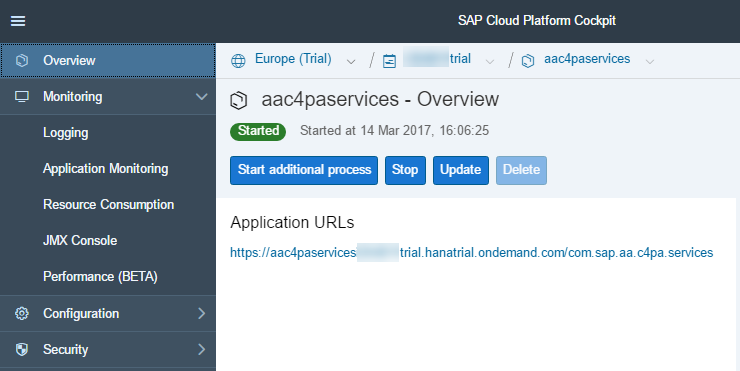
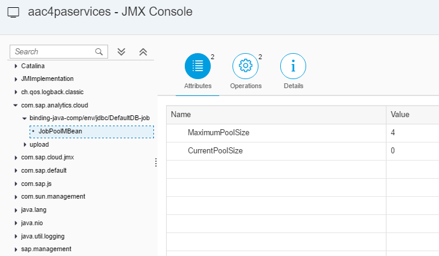
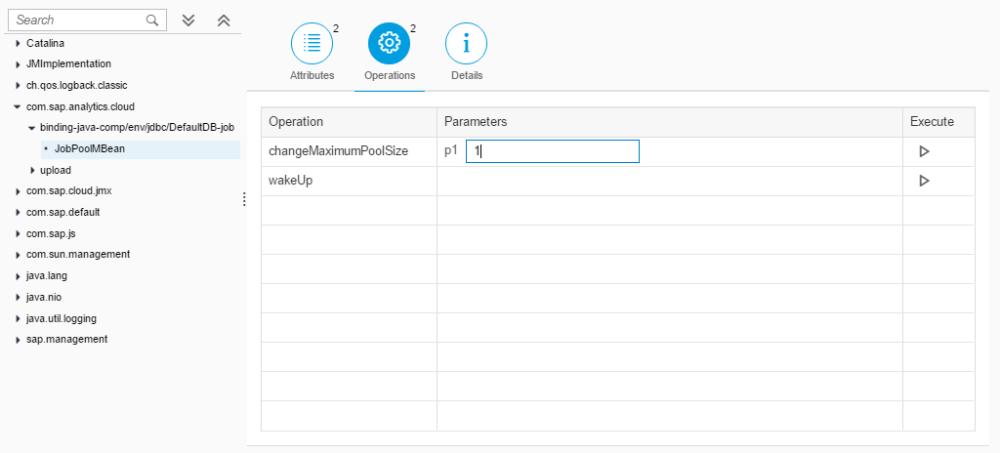

## Prerequisites
  - **Proficiency:** Beginner
  - **Tutorials:** [Enable, deploy and configure the SAP Cloud Platform predictive services](http://www.sap.com/developer/tutorials/hcpps-ps-configure.html)

## Next Steps
 - [Install a REST client to interact with the SAP Cloud Platform predictive services](http://www.sap.com/developer/tutorials/hcpps-rest-client-install.html)
 - [View all How-Tos](http://www.sap.com/developer/tutorial-navigator.how-to.html)

## How-To Details

The HANA MDC instances available on the SAP Cloud Platform trial environment are limited to only 6GB of RAM.

Therefore it is really important to control the load else your HANA MDC will simply restart because not enough resources are available.

The SAP Cloud Platform predictive services are by default configured to run at most 4 jobs in parallel.

A job is created whenever you run one the SAP Cloud Platform predictive services in asynchronous mode.

The number of concurrent jobs is limited by the number of available database connections in the pool.

Luckily this parameter is exposed as one of the JMX (Java Management Extensions) parameters of the `aac4paservices` Java application.

It can be configured without changing any piece of code in the SAP Cloud Platform predictive services deployed application via the JMX Console.

### Time to Complete
  **10 minutes**

[ACCORDION-BEGIN [Step 1: ](Access the JMX Console)]

Now that the `aac4paservices` is deployed and started, you will be able to access the **JMX Console**.

On the left side menu bar, you can expand **Monitoring > JMX Console**.

[DONE]
[ACCORDION-END]

[ACCORDION-BEGIN [Step 2: ](Access the database pool size parameter)]

Now, expand `com.sap.analytics.cloud` > `binding-java-comp/env/jdbc/DefaultDB-job` > `JobPoolMBean` from the tree.

As you can see the default value is 4.

[DONE]
[ACCORDION-END]

[ACCORDION-BEGIN [Step 3: ](Modify the database pool size parameter)]

Click on **Operations**, and enter 1 as the `changeMaximumPoolSize` parameter value.

Click on the execute icon .

An new entry will appear in the **Operation results**.

> Note: if you click back on **Attributes*, you will notice that the updated value is not displayed. You will need to refresh the page or switch to another parameter.
>
> It is not required to restart the application after the parameter is updated. and if the application is restarted, the change will be maintained.

[DONE]
[ACCORDION-END]

## Next Steps
- [Install a REST client to interact with the SAP Cloud Platform predictive services](http://www.sap.com/developer/tutorials/hcpps-rest-client-install.html)
- [View all How-Tos](http://www.sap.com/developer/tutorial-navigator.how-to.html)
