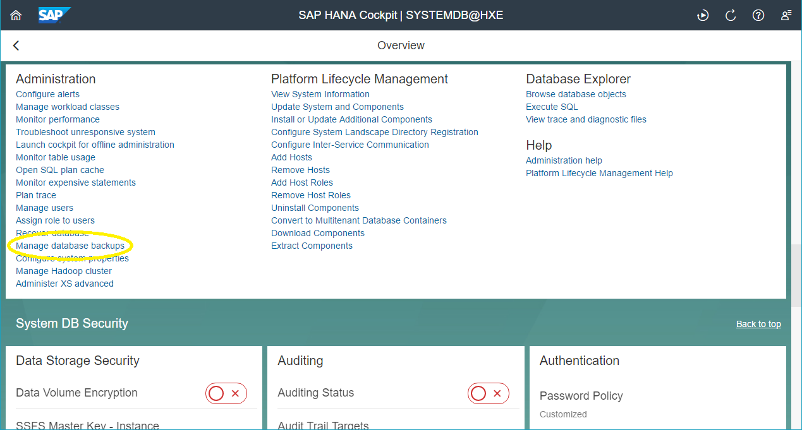
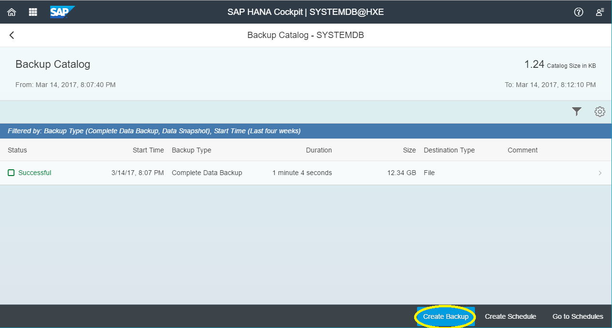
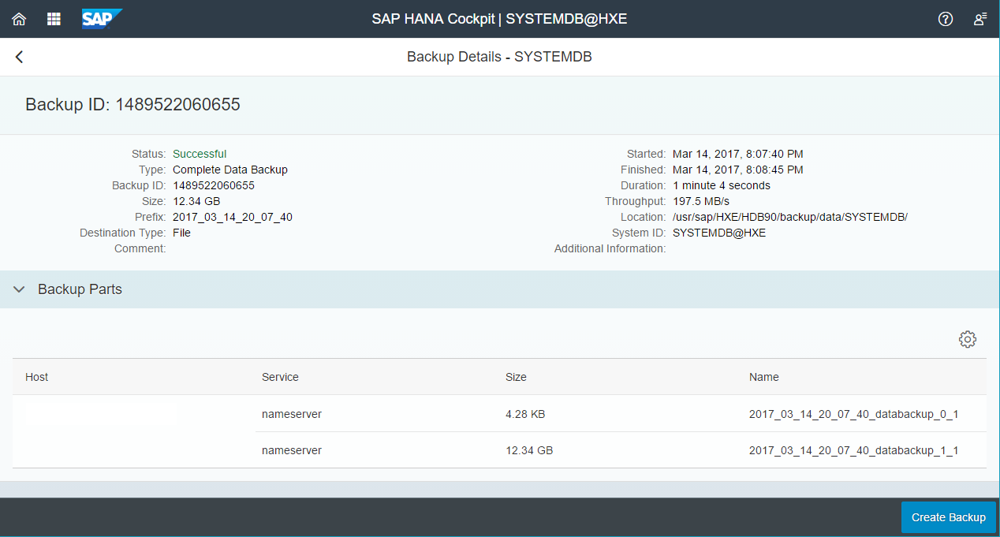
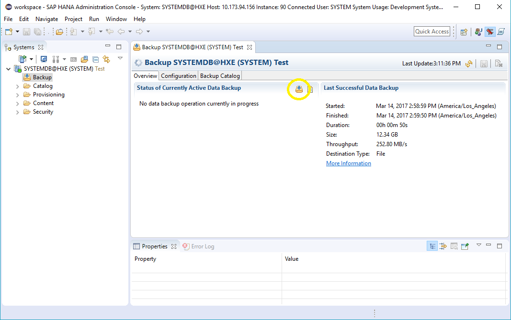
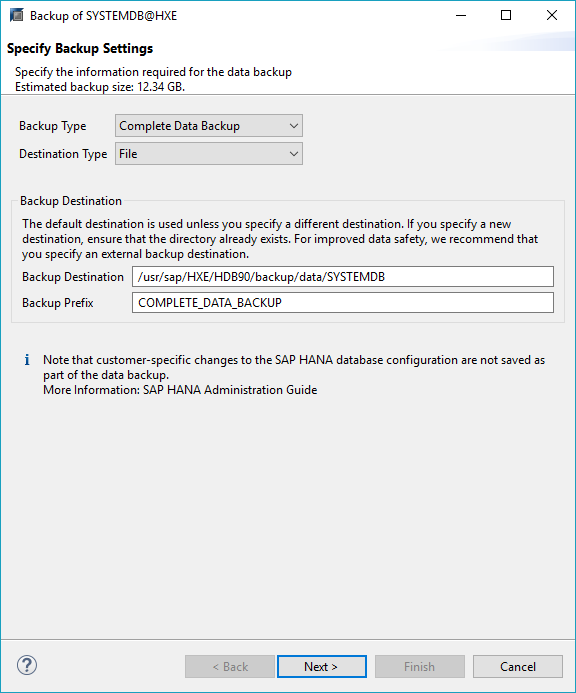

## Prerequisites  
 - [Database Fundamentals - Create a Tenant Database](http://www.sap.com/developer/tutorials/teched-2016-6.html)


## Next Steps
 - [Database Fundamentals - Install and Configure ODBC](http://www.sap.com/developer/tutorials/teched-2016-8.html)
 - Select a tutorial from the [Tutorial Navigator](http://www.sap.com/developer/tutorial-navigator.html) or the [Tutorial Catalog](http://www.sap.com/developer/tutorials.html)

## Details
### You will learn  
How to create a backup for you database using either HANA Cockpit, HANA Studio, or a SQL command line.

### Time to Complete
**15 Min**

---

[ACCORDION-BEGIN [Option 1: ](SAP HANA Cockpit)]

> Note:
> This option requires an SAP HANA, express edition Server + Applications installation.

1. Open SAP HANA Cockpit and log in using `XSA_ADMIN`.

2. Open your system database in the __Resource Directory__ window.

3. Scroll down to the __System DB Monitoring and Administration__ section and click _Manage database backups_ under __Administration__.

    

4. On the bottom right of the page, click _Create Backup_.

    

5. Select your _Backup Type_ and _Destination Type_. You may also change the _Backup Prefix_ and _Backup Destination_. By default the values for _Backup Prefix_ and _Backup Destination_ are `<date>_<time>` and `/usr/sap/<sid>/HDB90/backup/data/SYSTEMDB/`.

    Click __Back Up__ to create your backup.

    

6. A new page will open with a progress bar. Creating your backup will take a few minutes.

7. Once the backup is complete, a new page will show your successful backup. Two files are created: `<backup_prefix>_databackup_0_1` and `<backup_prefix>_databackup_1_1`.

    

[DONE]
[ACCORDION-END]

[ACCORDION-BEGIN [Option 2: ](SAP HANA Studio)]

> Note:
> This option requires you to have completed the [How to download and install the HANA Eclipse plugin](https://www.sap.com/developer/how-tos/2016/09/hxe-howto-eclipse.html) How-To.

1. On SAP HANA Studio, log on to your SAP HANA, express edition installation.

2. Double-click the _Backup_ icon .

3. If this is your first backup, under the __Overview__ tab, click _back up now_. If this is not your first backup, click the _Open Backup Wizard_ icon  by __Status of Currently Active Data Backup__.

    

    The backup window opens.

4. Choose your Backup Type and Destination Type as necessary. By default, the values are `Complete Data Backup` and `File`.

    - Choose your Backup Destination and Backup Prefix. This will be where your files are stored and what they will be called. By default, the values are `/usr/sap/<sid>/HDB<instance_number>/backup/data/SYSTEMDB` and `COMPLETE_DATA_BACKUP`.

    - When you are finished, click __Next >__.

    

5. Review your backup settings and click __Finish__ to begin creating your backup. Creating your backup will take a few minutes.

[DONE]
[ACCORDION-END]


[ACCORDION-BEGIN [Option 3: ](SQL and Command Line)]

1. In SAP HANA Studio or another connected SQL command line, create a backup user and grant it backup permissions.

    ```bash
    CREATE USER backup_operator PASSWORD <password> NO FORCE_FIRST_PASSWORD_CHANGE;
    GRANT BACKUP OPERATOR to backup_operator;
    ALTER USER backup_operator DISABLE PASSWORD LIFETIME;
    ```

    This creates the user _backup_operator_ with the given password and tells the system to not require a password change upon first login. It gives also gives _backup_operator_ permission to make backups. You will be using this user to only create backups so logging in for each backup is not required. You only need to do this once.

2. Connect to your SAP HANA, express edition installation using a command line.

3. Log in as `hxeadm`.

    ```bash
    su -l hxeadm
    ```

3. Create the _backup_ key.

    Execute the following command to create the user key _backup_.

    ```bash
    hdbuserstore -i SET backup <hostname>:3<instance_number>13 backup_operator
    ```

4. Create the file `backup.sh`.

    ```bash
    vi backup.sh
    ```

    Copy and paste the following code:

    ```bash
    ## defines backup prefix
    TIMESTAMP="$(date +\%F\_%H\%M)"
    BACKUP_PREFIX="SCHEDULED"
    BACKUP_PREFIX="$BACKUP_PREFIX"_"$TIMESTAMP"
    # TENANT="<tenant_database_name>"
    ## runs the backup sequence using the backup key
    hdbsql -U backup "backup data using file ('$BACKUP_PREFIX')"
    # hdbsql -U backup "backup data for $TENANT using file ('$BACKUP_PREFIX')"
    ```

    This script will be used to create your backups. If you need to backup more than one database (you have tenant databases, for example), use the commented sections as a template.

5. Give `backup.sh` run permission.

    ```bash
    chmod u+x backup.sh
    ```

6. Run `backup.sh`.

    ```bash
    <location_of_backup_script>/backup.sh
    ```

    Example:

    ```
    /hana/shared/HXE/HDB90/backup.sh
    ```

    Wait while your backup is created.

7. (Optional) Check your backup repository to ensure your backup was created.

    ```bash
    ls /usr/sap/<sid>/HDB<instance_number>/backup/data/SYSTEMDB
    ```

    Example:

    ```
    ls /usr/sap/HXE/HDB90/backup/data/SYSTEMDB
    ```

    A list of your backup files is displayed.

[DONE]
[ACCORDION-END]


## Next Steps
 - [Database Fundamentals - Create a Tenant Database](http://www.sap.com/developer/tutorials/teched-2016-6.html)
 - [View all How-Tos](http://www.sap.com/developer/tutorial-navigator.how-to.html)
