## Prerequisites  
 - Amazon Web Services account. Create AWS account or use existing account.

## Next Steps
 - View other [SAP Vora How-Tos](https://www.sap.com/developer/tutorial-navigator.how-to.html?tag=products:data-management/sap-hana-vora) or visit the [SAP Vora Developer](https://www.sap.com/developer/topics/vora.html) Page.

## How-To Details
This How-to is a step by step guide to create a Virtual Private Cloud (VPC) in AWS for SAP Vora AWS Marketplace Production Edition

### Time to Complete
**20 min**.

---

[ACCORDION-BEGIN [Step 1: ](Create virtual private cloud)]

Log in to the AWS console and choose **VPC** from **Services** in AWS. Select **Your VPC**.

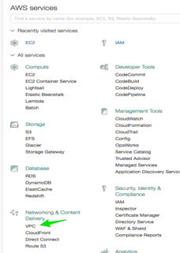

Click **Create VPC**.

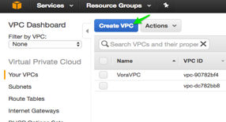

Fill in the name, CIDR block and tenancy in fields and click **Create VPC**.

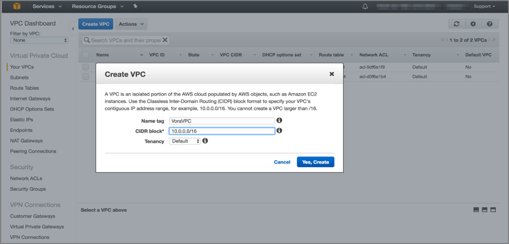

[DONE]
[ACCORDION-END]

[ACCORDION-BEGIN [Step 2: ](Create subnet)]

Click on the **Subnets** tab on left panel and click **Create Subnet**. Fill in the values for subnet and choose the VPC created in the previous step.

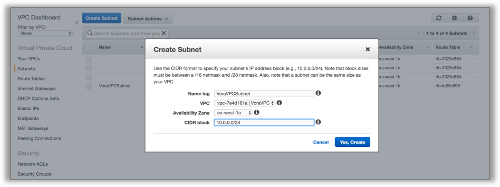

Click on **Route table** in the left panel and click on the route table that is associated with your current selection of a VPC. Click on **Subnet associations | edit**  and associate the subnet that you just created and click **Save**.

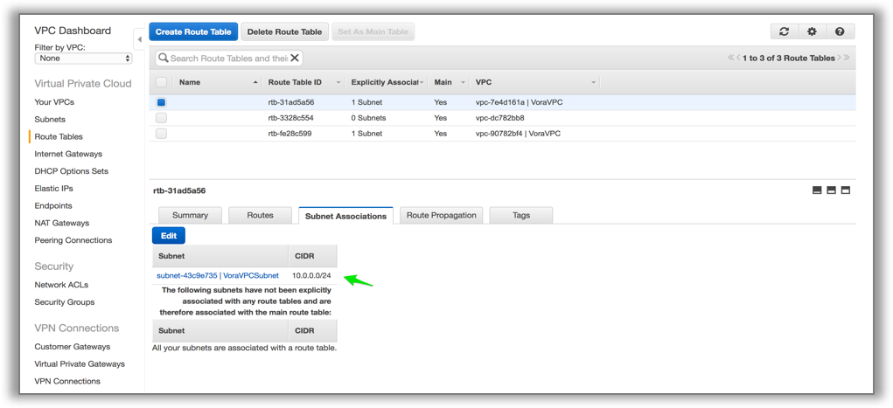

[DONE]
[ACCORDION-END]

[ACCORDION-BEGIN [Step 3: ](Create gateway)]

Click on **Internet Gateways** in the left panel and select **Create Internet Gateways**. Provide the name tag and click **Yes, Create**.

Note that the gateway is detached. Right click on the Internet gateway created and attach it with the created VPC.

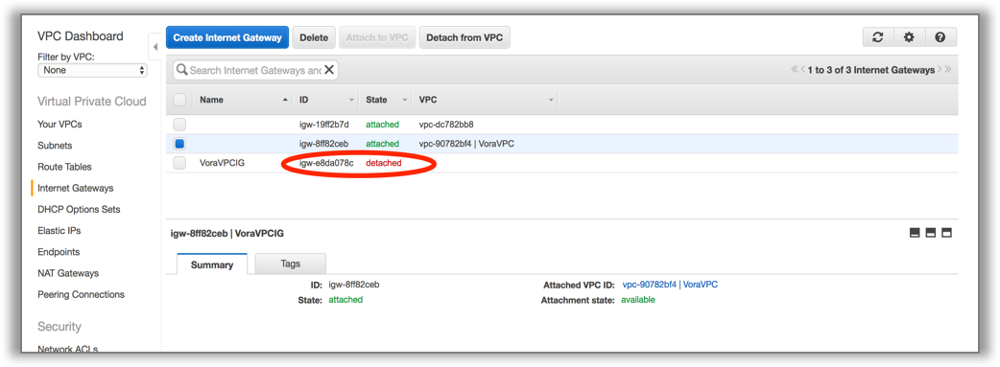

Click on **Create Route Table** and select the route table created. In the tab below select **Routes**. Click on **edit** button and add the internet gateway created above with destination as `0.0.0.0/0`.

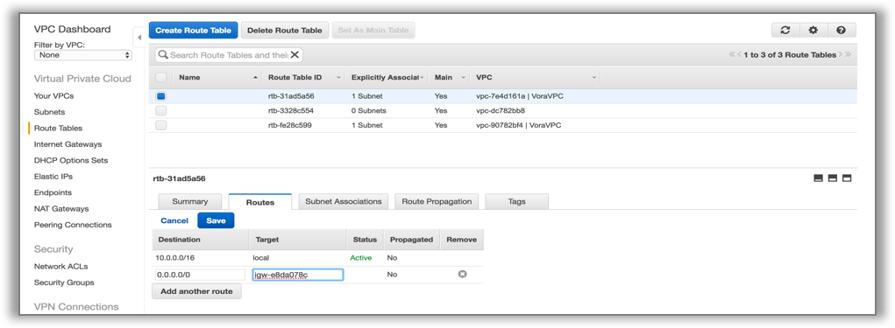

[DONE]
[ACCORDION-END]

[ACCORDION-BEGIN [Step 4: ](Modify public IP address)]

Modify the Auto-assignable public IP, so that the Public IP gets assigned to the instance when it is launched with the selected VPC.

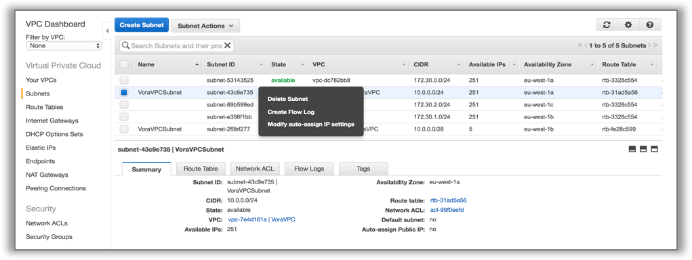

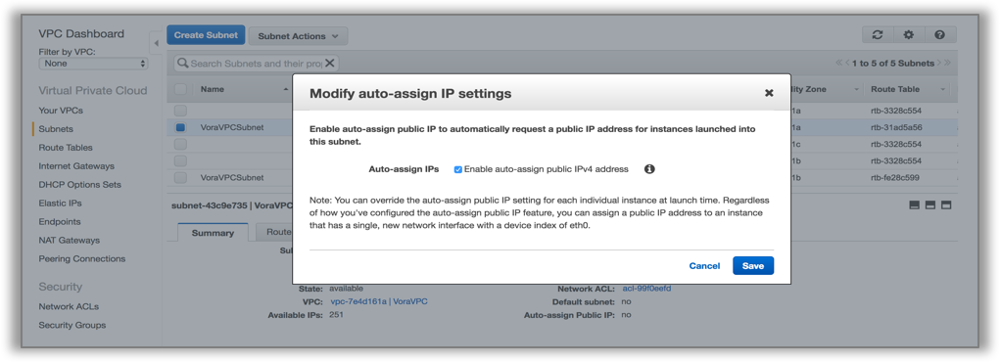

[DONE]
[ACCORDION-END]

[ACCORDION-BEGIN [Step 5: ](Enable DNS resolution and DNS host names)]

Enable DNS Resolution and DNS Host names by editing the VPC setting. Select the VPC created in the above steps and click on **Actions**.

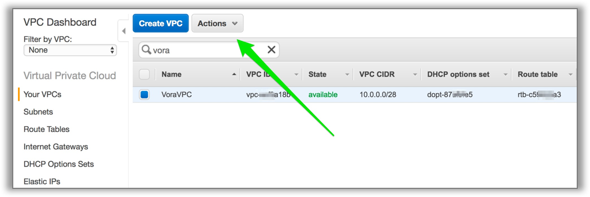

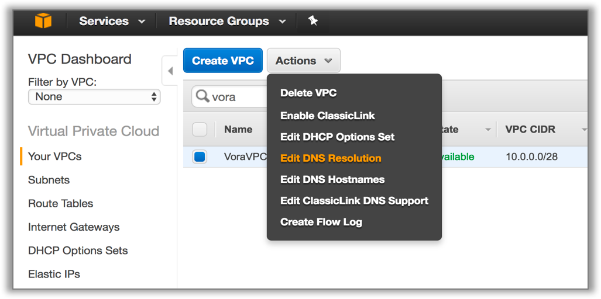

Click **Yes** to edit DNS resolution.

Click **Yes** to edit DNS host names.

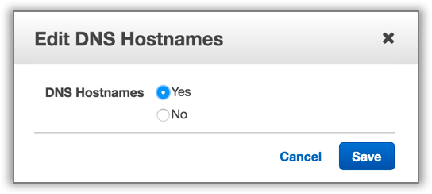

[DONE]
[ACCORDION-END]

[ACCORDION-BEGIN [Step 6: ](Set as default VPC)]

Select this VPC while launching a SAP Vora Manager instance.

[DONE]
[ACCORDION-END]

## Next Steps
 - View other [SAP Vora How-Tos](https://www.sap.com/developer/tutorial-navigator.how-to.html?tag=products:data-management/sap-hana-vora) or visit the [SAP Vora Developer](https://www.sap.com/developer/topics/vora.html) Page.
