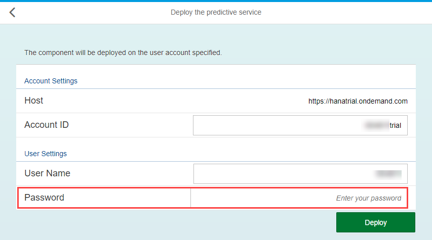
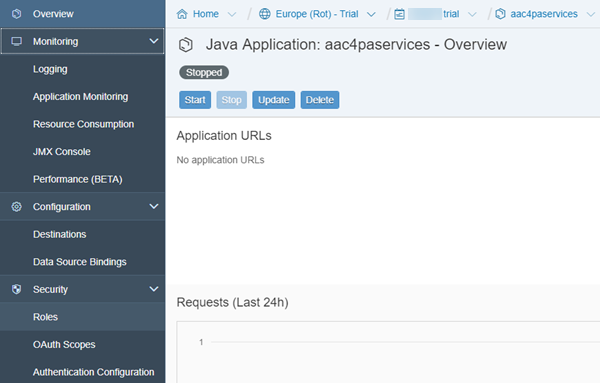
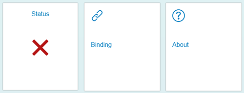
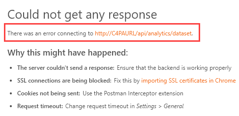
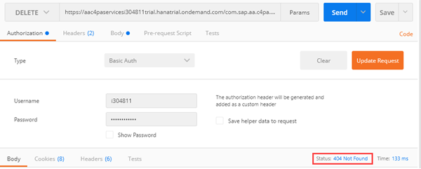

## Prerequisites  
 - XXXXXXXX

## Next Steps
 - [View all How-Tos](http://www.sap.com/developer/tutorial-navigator.how-to.html)


## How-To Details
The intent of this trouble shooting guide is to highlight few of the most common issues encountered while starting using the SAP Cloud Platform Predictive Services.

This guide has been built and structured to cover the different situations where you may face these issue.

And if you find an easier way to fix any issues listed here, or new issues with a  way to fix it, you are more than welcome to use the "Provide feedback" on the page to share your solution.

If you face an issue that is not listed here, please submit this one on the [SAP Cloud Platform Predictive Service ](https://answers.sap.com/tags/73555000100800000130) community page.

As this is a living document, make sure you bookmark it check periodically the updates!

### Time to Complete
**10 Min**.

---

[ACCORDION-BEGIN [Topic: ](Enabling the service)]

If you have an issue enabling the service, unfortunately there is nothing you can do as end-user to fix it, you will have to deal with SAP support for the SAP Cloud Platform.

However, let me explain you what actually happens when you click on the  button which will enable the **Go to Service** link.

The  button will trigger an "activation" request to the SAP Cloud Platform "activation" service.

The SAP Cloud Platform have multiple activation strategy/architecture based on the service you are looking at.

For the SAP Cloud Platform Predictive Service, the activation will create a new entry in the SAP Cloud Platform "routing" service.

This "routing" entry will "proxy" a URL bound to your account that points to the "service deployment application" which is hosted by the SAP Cloud Platform Predictive Service provisioning account (a separate SAP Cloud Platform account from yours).

This "proxy" URL is the one that will be used when you click on the **Go to Service** link and should look like this (where XXXXXXXXXXX is your account identifier):

```
https://aacockpitc4pa-XXXXXXXXXXXtrial.hanatrial.ondemand.com/com.sap.aa.hcp.cockpit/
```

> If you are unclear with what is your SAP Cloud Platform credentials and identifiers, you can refer to the following blog entry: [SAP Cloud Platform login, user name, account id, name or display name: you are lost? Not anymore!](https://blogs.sap.com/2017/01/31/sap-hana-cloud-platform-trial-login-name-user-name-account-name-account-identifier-you-are-lost-not-anymore/)

&nbsp;

The "service deployment application" will allow you deploy a Java application exposing the REST API to your account.

Keep also in mind that the SAP Cloud Platform Predictive Service is not available by default on productive accounts, you will need the proper license/subscription to be able to enable it.

With your personal developer/trial account, the service doesn't require any license/subscription to be able to enable it.

[ACCORDION-END]

[ACCORDION-BEGIN [Topic: ](Access the service link)]

Once the SAP Cloud Platform Predictive Service is enabled, then the **Go to Service** will be activated and expose the "proxy" URL.

Again here, if you can't access the "proxy" URL, there is nothing you can do as end-user to fix it, as it probably means that there is an issue with the SAP Cloud Platform "routing" service or the SAP Cloud Platform Predictive Service provisioning account.

[ACCORDION-END]

[ACCORDION-BEGIN [Topic: ](Deploying service)]

One of the most common problem here when deploying the predictive service application to your account is: "which password should I use?"

As you are deploying the predictive service application to your SAP Cloud Platform account, it's your SAP Cloud Platform account password.



> If you are unclear with what is your SAP Cloud Platform credentials and identifiers, you can refer to the following blog entry: [SAP Cloud Platform login, user name, account id, name or display name: you are lost? Not anymore!](https://blogs.sap.com/2017/01/31/sap-hana-cloud-platform-trial-login-name-user-name-account-name-account-identifier-you-are-lost-not-anymore/)

&nbsp;

----

## Common issues:

----

### **Error during the deployment**

If the application cannot be deployed, you should get a message on the screen and you can check the warning icon  on the bottom left corner of the screen for more details.

----

###  **Error redeploying the application**

----

If you have deployed the application previously, and you cannot redeploy the application, then you should delete the application first and try to re-deploy it again.

----

Once the deployment process is completed you will get a message and a link to the deployed application overview page.


----

[ACCORDION-END]

[ACCORDION-BEGIN [Topic: ](Starting service application)]

The deployed predictive service application which exposes the REST API is "just" a Java application deployed to your SAP Cloud Platform account and will consume compute units just like any other Java application.



## Common issues:

----

### **Not enough compute units available**

----

In a productive account, you may have multiple compute units but also multiple Java application running at the same time. So check your account quota.

With your personal developer/trial account, you only have one compute unit, so make sure you stop your other applications.

----

### **Application is not starting**

----

If the application cannot start and hangs on with a "Starting" status for a while then goes to "Error"

This one might be related to multiple causes and the best way to diagnose is to check the logs available under **Monitoring** > **Logging**.

Check the latest "Default Traces" item using the display  or download  icon.

The trace content will be helpful if you create a support case or submit a question on the [SAP Cloud Platform Predictive Service ](https://answers.sap.com/tags/73555000100800000130) community page.

[ACCORDION-END]

[ACCORDION-BEGIN [Topic: ](Accessing the service application URL)]

Now that the deployed predictive service application is started we should be able to access the embedded web portion which gives you access to a documentation section and the administration panels.


## Common issues:

----

### **Service Unavailable error**

----

When I click on the **Application URL** link, I receive the following error message:

```
Service Unavailable - No server is available to handle this request, or the application aac4paservicesXXXXXXXtrial.hanatrial.ondemand.com is temporarily down for maintenance. Excuse us for the inconvenience.
```

This message is displayed when the application is either stopped not yet fully started.  

Check the application status.

If the application is started, then the best way to diagnose the issue is to check the logs available under **Monitoring** > **Logging**.

Check the latest "Default Traces" item using the display  or download  icon.

The trace content will be helpful if you create a support case or submit a question on the [SAP Cloud Platform Predictive Service ](https://answers.sap.com/tags/73555000100800000130) community page.

----

### **HTTP Status 403 on the API Documentation or the Administration panel**

----

When I click on the **Predictive Services API Documentation** tile or the **Administration** tile, I receive the following error message:

```
HTTP Status 403 - Access to the requested resource has been denied
```

- With the **Predictive Services API Documentation** tile, this message is displayed when your account is not granted the **`C4PA-User`** role.

- With the **Administration** tile, this message is displayed when your account is not granted the **`C4PA-Admin`** role.  

Go back to the `aac4paservicess` overview page in the SAP Cloud Platform Cockpit, then under **Security** > **Roles**, and assign your current account id to the **`C4PA-User`** and the **`C4PA-Admin`** role.

(Hint: your user identifier is the piece blur on most of the screenshots, without the "trial")

A restart of the `aac4paservicess` application will be required.

> If you are unclear with what is your SAP Cloud Platform credentials and identifiers, you can refer to the following blog entry: [SAP Cloud Platform login, user name, account id, name or display name: you are lost? Not anymore!](https://blogs.sap.com/2017/01/31/sap-hana-cloud-platform-trial-login-name-user-name-account-name-account-identifier-you-are-lost-not-anymore/)

&nbsp;

----

### **No database binding has been defined**

----

When I click on the **Application URL** link, I receive the following error message: `No database binding has been defined`


This can happen for multiple reasons:

1. Check there is no **Data Source Binding** defined for your HANA MDC instance in the `aac4paservicess` application  

    Go back to the `aac4paservicess` overview page in the SAP Cloud Platform Cockpit, then under **Configuration** > **Data Source Bindings**, and add a binding to your HANA MDC instance.

    A restart of the `aac4paservicess` application will be required.

1. Check that the **Data Source Binding** is configured but with a user that is missing the `APL_EXECUTE` role

    Using the **SAP HANA Web-based Development Workbench**, run the following SQL statement (after you replace the **TRIAL** HANA user name with yours).

    ```SQL
    SELECT "USER_NAME", "ROLE_NAME" FROM "PUBLIC"."EFFECTIVE_ROLES" where "USER_NAME" = 'TRIAL' and "ROLE_NAME" = 'sap.pa.apl.base.roles::APL_EXECUTE';
    ```

    If this returns no rows, it means that your user is missing the APL role, so you will have to execute the following statement (after you replace the **TRIAL** HANA user name with yours):

    ```SQL
    call _SYS_REPO.GRANT_ACTIVATED_ROLE ('sap.pa.apl.base.roles::APL_EXECUTE','TRIAL');
    ```

1. Check that the **Binding** is correctly initialized in the application

    Click on the **Administration** tile, where the status should be a red cross, the click on **Binding**

    

    You should get the following screen where the **Initialized** status in error:

    

    > If you don't have any entry displayed, then select `java:comp/env/jdbc/DefaultDB` in the drop down and click on the plus  icon.

    Click on **Re-Initialize**  icon. A message box should appear with a detailed error message providing you guidelines about how to fix it.

    You can also delete and recreate the binding if re-initializing is not working from here.

[ACCORDION-END]

[ACCORDION-BEGIN [Topic: ](Consuming the service from a REST client)]

In the tutorial, it is recommended to install the Postman extension for Google Chrome, but any other REST client should work as fine as long as you can configure properly the different parameters of each request.

## Common issues:

----

### **Could not get any response**

----

This error is usually caused because the URL entered is incorrect.



In the tutorial, `C4PAURL` is used to reference your application URL, but is not properly replaced in the field.

For example, in the "Dataset" call you will have to use the following URL:

  - `C4PAURL/dataset/sync`

Which would give you something like this (where XXXXXXXXXXX is your account identifier:

  - https://aac4paservicesXXXXXXXXXXXtrial.hanatrial.ondemand.com/com.sap.aa.c4pa.services/dataset/sync

----

### **405 Method Not Allowed**

----

Most of the predictive services uses `GET` or the `POST` method and by default, all services will return a response even if an error is triggered. So, if you don't get any response, it most likely due to an unsupported method error as displayed on the following screenshot.


Make you are using the right method as detailed in the tutorial.

----

### **404 Not Found**

----

Most of the predictive services uses `GET` or the `POST` method, but some uses the `DELETE` method, for example to delete a job or a dataset registration.

The identifier for the item to be deleted is passed in the URL.

When the item is not found, then the service will return a **404 Not Found** and this is as designed.



----

### **Your browser does not support JavaScript**

----

In the tutorial, it is recommended to install the Postman Interceptor extension for Google Chrome which will allow Postman to use your current browser session and its cookies.

Therefore your credentials won't be validated what you are using for the **``Basic Auth`** fields.

However, if your session expires in Google Chrome you won't be able to access the services anymore unless the `aac4paservices` application is properly configured and the provided credentials are correct.

This is the error message you will receive:

```JavaScript
<!DOCTYPE html PUBLIC "-//WAPFORUM//DTD XHTML Mobile 1.0//EN" "http://www.wapforum.org/DTD/xhtml-mobile10.dtd">
<html xmlns="http://www.w3.org/1999/xhtml">
    <head>
        <meta name="viewport" content="width=device-width, initial-scale=1.0, maximum-scale=1.0, user-scalable=no, shrink-to-fit=no">
        <meta http-equiv="pragma" content="no-cache" />
    </head>
    <body style="background-color:#FFFFFF" onload="var url=window.location.hash;if(url&&0!==url.length){var anchorCookie='oucrszlgqsasuroctotpzddvo_anchor=&quot;'+encodeURIComponent(url)+'&quot;';document.cookie=anchorCookie}document.forms[0].submit()">
        <p>
            <script language="javascript">document.write("Please wait ...");</script>
        </p>
        <noscript>
            <p>Note: Your browser does not support JavaScript or it is turned off. Press the button to proceed.</p>
        </noscript>
        <form method="post" action="https://accounts.sap.com/saml2/idp/sso/accounts.sap.com">
            <input type="hidden" name="SAMLRequest" value="xxxxxxxxxxxxxxxxxxxxxxxxxxxxxxxx"/>
            <input type="hidden" name="RelayState" value="xxxxxxxxxxxxxxxxxxxxxxxxxxxxxxxx"/>
            <noscript>
                <input type="submit" value="Continue"/>
            </noscript>
        </form>
    </body>
</html>
```
and in the Postman context:


1. Check the **Authentication Configuration**

    Go back to the `aac4paservicess` overview page in the SAP Cloud Platform Cockpit, then under **Security** > **Authentication Configuration**.

    Make sure that **Custom Configuration** is active  and if not click on **Activate Custom Configuration**.

    Make sure that the **User name and password** and **Client certificate**.

    After making any update, click on **Save**.

    Then you will need to restart the `aac4paservicess` application

    

1. Check your SAP credentials

    When using an account on any of the SAP site, you will be locked after 5 failed attempts.

    However, you won't get an explicit message stating that your user has been locked (for security reasons).

    If you have a session that is open, you will be able to keep it until it expires.

    So, you will have to explicitly logout (usually you  will get a button for that in the upper right corner of the screen).

    If you can't login again, it probably means that you will need to reset your password using the provided link on the screen.

1. Check your SAP credentials in Postman

    When you enter your credentials in Postman, they will be encoded once in the header in a key named **Authorization**.

    

    So if you want to update your credentials, you will have to either delete the header entry or use the **Update Request** on the **Authorization**.

    You also have the possibility to view the current password using the **Show Password** checkbox.

[ACCORDION-END]

[ACCORDION-BEGIN [Topic: ](Consuming the service from a SAPUI5 application)]

When building your SAPUI5 application to interact with the predictive services, we will assumes that you have configured your **Authentication Configuration** properly.

So, before starting investigating you SAPUI5 application, make sure you are able at least to [Test the "Dataset" service using a REST Client](https://www.sap.com/developer/tutorials/hcpps-rest-ps-dataset.html).

If this test works, then you can start checking the following common issues.

## Common issues:

----

### **500 Internal Server Error - Invalid reference to destination 'psapi' in account 'XXXXXXXtrial'**

----

In order to access the predictive services and to comply with [Cross-origin resource sharing (a.k.a. CORS](https://fr.wikipedia.org/wiki/Cross-origin_resource_sharing), the SAPUI5 application will register in the `neo-app.json` the **Destination** to be used to proxy the `aac4paservicess` application URL.

1. Check the `neo-app.json`

    In the Web IDE, open the `neo-app.json` and make sure you have an entry like this:

    ```JavaScript
    {
			"path": "/ps",
			"target": {
				"type": "destination",
				"name": "psapi"
			},
			"description": "SAP Cloud Platform Predictive  destination"
		}
    ```

    Where:
     - `/ps` is the URL that will be used as the proxy URL in your SAPUI5 application
     - `psapi` is the name of the destination configured in the SAP Cloud Platform Cockpit with the `aac4paservicess` application URL

    Make sure you save  the file and run the application again using the run  if you apply any changes.

1. Check the **Destination**

    In the SAP Cloud Platform Cockpit, under **Connectivity** > **Destination** (at the account level not within the `aac4paservicess` application), check that your destination is properly configured as detailed in step 1 from [Configure a SAPUI5 application from the project template](https://www.sap.com/developer/tutorials/hcpps-sapui5-configure-application.html).

    >**Note**: If you save any change details of your destination, you will need to refresh the Web IDE page for the change to be applied and restart your application.

    &nbsp;

    As an additional test, you can try to switch from `AppToAppSSO` authentication to `BasicAuthentication` and use your SAP Cloud Platform credentials.

    > If you are unclear with what is your SAP Cloud Platform account name, you can refer to the following blog entry: [SAP Cloud Platform login, user name, account id, name or display name: you are lost? Not anymore!](https://blogs.sap.com/2017/01/31/sap-hana-cloud-platform-trial-login-name-user-name-account-name-account-identifier-you-are-lost-not-anymore/)

    &nbsp;

    If using `BasicAuthentication` and your SAP Cloud Platform credentials works, it probably means that **Principal Propagation** is not enabled in your account and in this case, revert to `AppToAppSSO` authentication and go to the next section.

1. Check the **Principal Propagation**

    In the SAP Cloud Platform Cockpit, under **Security** > **Trust**, check that **Principal Propagation** is set to enabled.

    Changing the **Principal Propagation** value may affect other applications and services, and will require a browser refresh.


[ACCORDION-END]

[ACCORDION-BEGIN [Topic: ](Consuming the service in general)]

In this section, we will highlight common issues that doesn't fit in the other section (the a fallback section).

## Common issues:

----

### **Error detail: thread creation failed**

----

This problem should happen only with developer/trial accounts and is bound to the current capacity of your HANA MDC instance.

On the trial landscape, only 6GB of RAM is allocated per tenant. You may think this is a lot for your small dataset, but in fact only a portion of that is available for your data and process.

Your trial HANA MDC instance should get back on its feet shortly, but if you are as impatient as I'm the best way to resolve this issue is to restart your trial HANA MDC instance.

Alternatively, to avoid this issue you can limit the number of pooled connection to you HANA MDC instance from the `aac4paservicess` application by following the following guide: [How to update the database pool configuration of the SAP Cloud for predictive services](http://www.sap.com/developer/how-tos/2017/03/hcpps-ps-configure-dbpool.html)

[ACCORDION-END]

Make sure you check all these common issues.

Executing this diagnostic will be helpful if you create a support case or submit a question on the [SAP Cloud Platform Predictive Service ](https://answers.sap.com/tags/73555000100800000130) community page.

## Next Steps
 - [View all How-Tos](http://www.sap.com/developer/tutorial-navigator.how-to.html)
